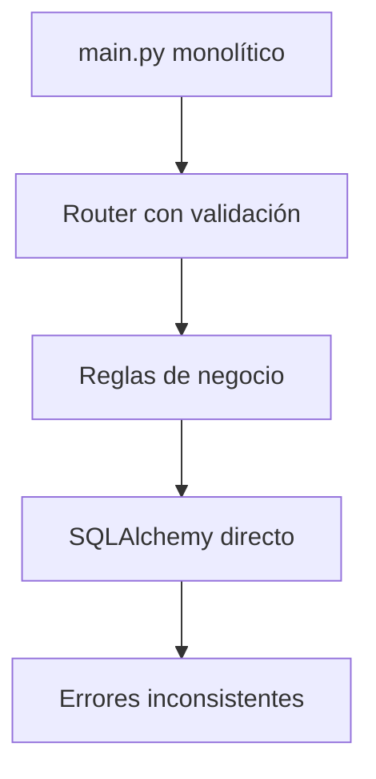
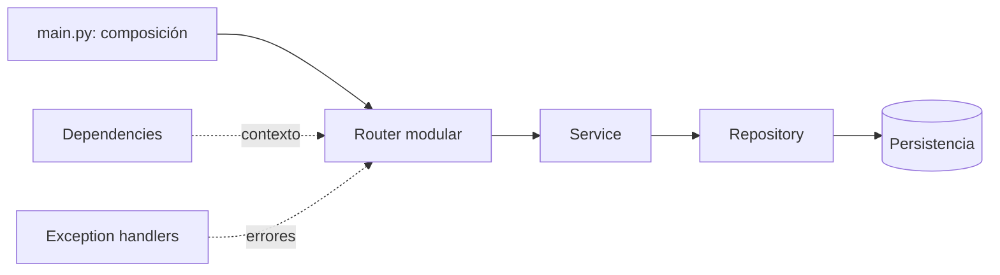
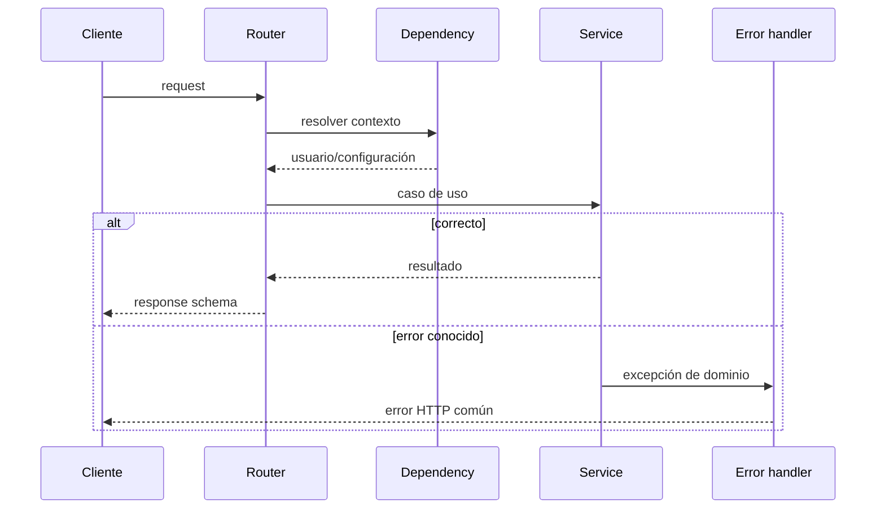

# Diagrama — Issue 01

## Antes y después

```mermaid
flowchart TD
 A[main.py monolítico] --> B[Router con validación]
 B --> C[Reglas de negocio]
 C --> D[SQLAlchemy directo]
 D --> E[Errores inconsistentes]
```

```mermaid
flowchart LR
 A[main.py: composición] --> B[Router modular]
 B --> C[Service]
 C --> D[Repository]
 D --> E[(Persistencia)]
 F[Dependencies] -. contexto .-> B
 G[Exception handlers] -. errores .-> B
```

## Lectura

La estructura modular hace visibles las responsabilidades y permite probar cada frontera por separado.

## Frontera entre capas

```mermaid
sequenceDiagram
 participant C as Cliente
 participant R as Router
 participant D as Dependency
 participant S as Service
 participant H as Error handler
 C->>R: request
 R->>D: resolver contexto
 D-->>R: usuario/configuración
 R->>S: caso de uso
 alt correcto
  S-->>R: resultado
  R-->>C: response schema
 else error conocido
  S->>H: excepción de dominio
  H-->>C: error HTTP común
 end
```
