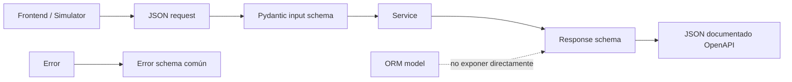
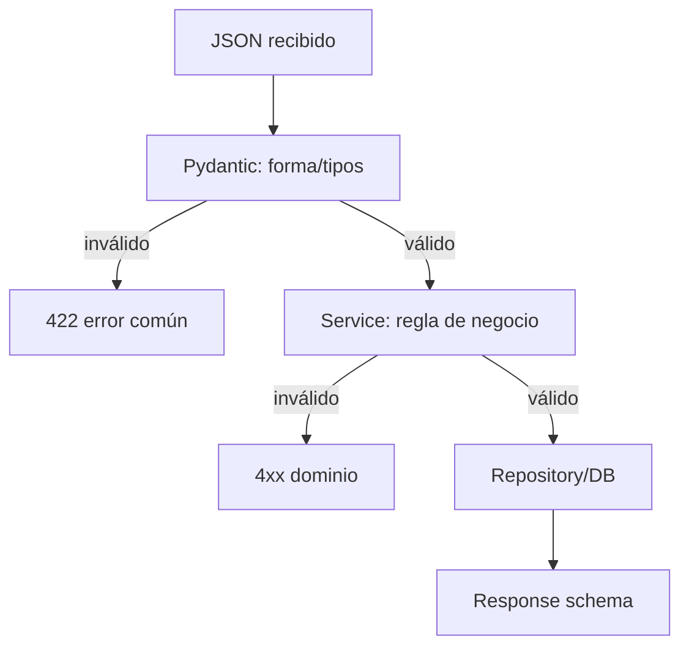

# Diagrama — Issue 02

```mermaid
flowchart LR
 A[Frontend / Simulator] --> B[JSON request]
 B --> C[Pydantic input schema]
 C --> D[Service]
 D --> E[Response schema]
 E --> F[JSON documentado OpenAPI]
 G[ORM model] -. no exponer directamente .-> E
 X[Error] --> Y[Error schema común]
```

Antes: cada consumidor adivina el formato. Después: request, response y errores forman un contrato verificable.

## Ciclo de validación

```mermaid
flowchart TD
 A[JSON recibido] --> B[Pydantic: forma/tipos]
 B -- inválido --> C[422 error común]
 B -- válido --> D[Service: regla de negocio]
 D -- inválido --> E[4xx dominio]
 D -- válido --> F[Repository/DB]
 F --> G[Response schema]
```
