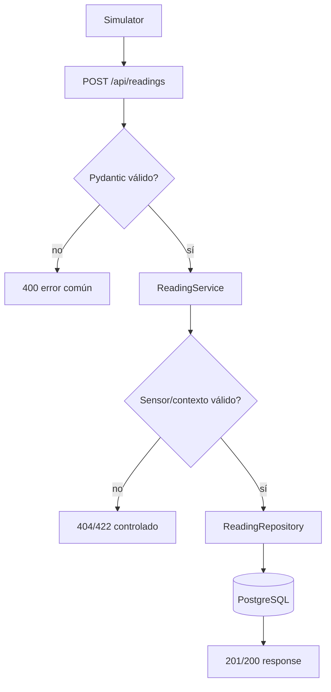
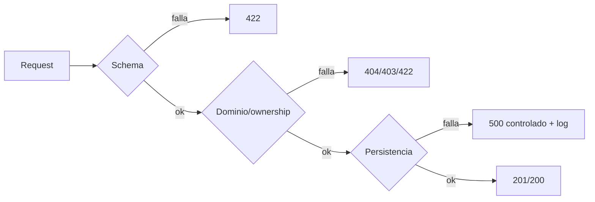

# Diagrama — Issue 03

```mermaid
flowchart TD
 A[Simulator] --> B[POST /api/readings]
 B --> C{Pydantic válido?}
 C -- no --> X[400 error común]
 C -- sí --> D[ReadingService]
 D --> E{Sensor/contexto válido?}
 E -- no --> Y[404/422 controlado]
 E -- sí --> F[ReadingRepository]
 F --> G[(PostgreSQL)]
 G --> H[201/200 response]
```

Antes: cliente podría escribir directamente en DB. Después: toda lectura atraviesa contrato, reglas y persistencia controlada.

## Errores posibles

```mermaid
flowchart LR
 A[Request] --> B{Schema}
 B -- falla --> C[422]
 B -- ok --> D{Dominio/ownership}
 D -- falla --> E[404/403/422]
 D -- ok --> F{Persistencia}
 F -- falla --> G[500 controlado + log]
 F -- ok --> H[201/200]
```
