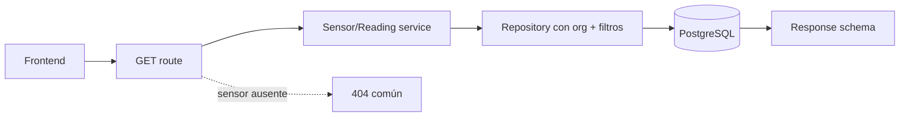

# Diagrama — Issue 04

```mermaid
flowchart LR
 U[Frontend] --> R[GET route]
 R --> S[Sensor/Reading service]
 S --> Q[Repository con org + filtros]
 Q --> DB[(PostgreSQL)]
 DB --> O[Response schema]
 R -. sensor ausente .-> E[404 común]
```

Antes: frontend necesitaba conocer la DB o endpoints ambiguos. Después: consulta documentada, acotada y filtrada por organización.

