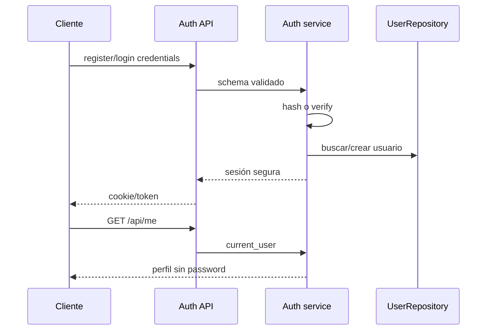
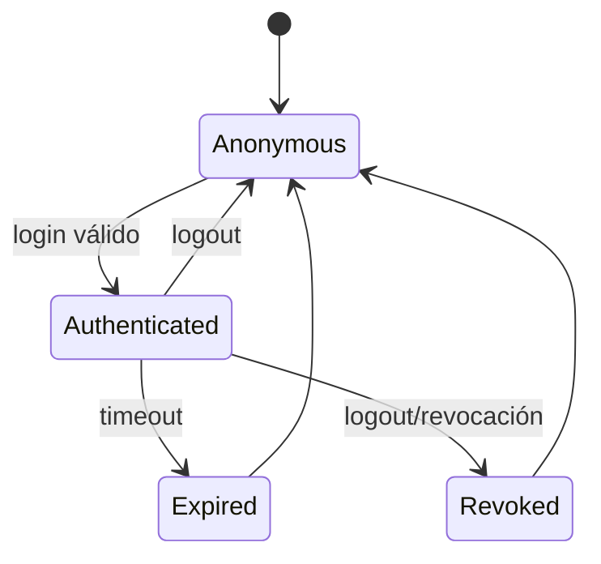

# Diagrama — Issue 05

```mermaid
sequenceDiagram
 participant C as Cliente
 participant API as Auth API
 participant S as Auth service
 participant DB as UserRepository
 C->>API: register/login credentials
 API->>S: schema validado
 S->>S: hash o verify
 S->>DB: buscar/crear usuario
 S-->>API: sesión segura
 API-->>C: cookie/token
 C->>API: GET /api/me
 API->>S: current_user
 S-->>C: perfil sin password
```

Antes: endpoints sin identidad verificable. Después: credencial segura y dependencia reutilizable.

## Estados de autenticación

```mermaid
stateDiagram-v2
 [*] --> Anonymous
 Anonymous --> Authenticated: login válido
 Authenticated --> Anonymous: logout
 Authenticated --> Expired: timeout
 Authenticated --> Revoked: logout/revocación
 Expired --> Anonymous
 Revoked --> Anonymous
```
