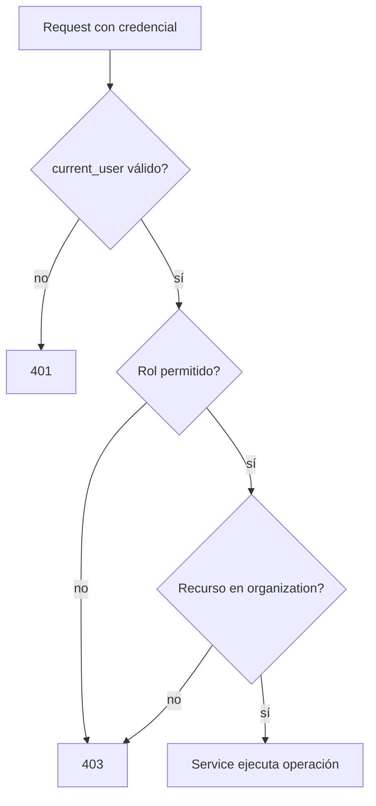

# Diagrama — Issue 06

```mermaid
flowchart TD
 A[Request con credencial] --> B{current_user válido?}
 B -- no --> X[401]
 B -- sí --> C{Rol permitido?}
 C -- no --> Y[403]
 C -- sí --> D{Recurso en organization?}
 D -- no --> Y
 D -- sí --> E[Service ejecuta operación]
```

Antes: el frontend decidía qué podía ver cada usuario. Después: cada request se verifica en backend por identidad, rol y tenant.

