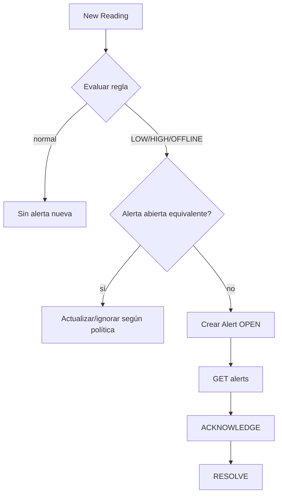

# Diagrama — Issue 07

```mermaid
flowchart TD
 R[New Reading] --> E{Evaluar regla}
 E -- normal --> N[Sin alerta nueva]
 E -- LOW/HIGH/OFFLINE --> D{Alerta abierta equivalente?}
 D -- sí --> U[Actualizar/ignorar según política]
 D -- no --> C[Crear Alert OPEN]
 C --> L[GET alerts]
 L --> A[ACKNOWLEDGE]
 A --> S[RESOLVE]
```

Antes: solo se veía el valor bruto. Después: el service transforma lecturas en un ciclo de vida consultable.

