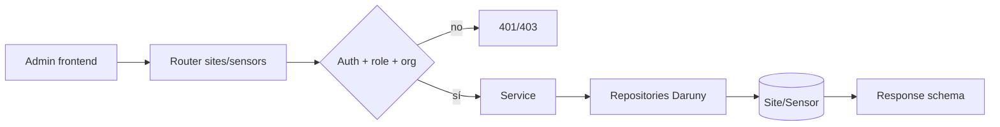
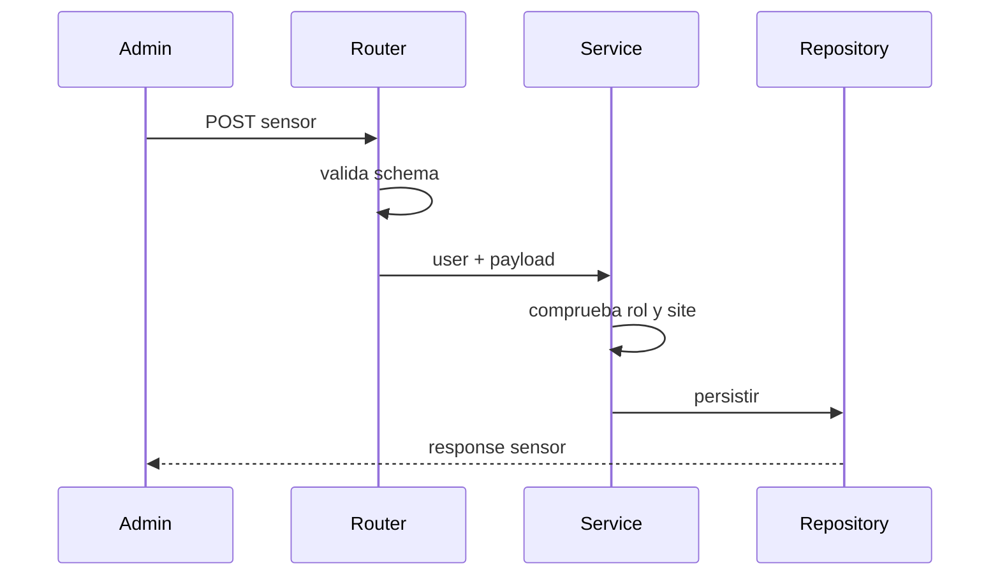

# Diagrama — Issue 08

```mermaid
flowchart LR
 U[Admin frontend] --> R[Router sites/sensors]
 R --> A{Auth + role + org}
 A -- no --> E[401/403]
 A -- sí --> S[Service]
 S --> Q[Repositories Daruny]
 Q --> DB[(Site/Sensor)]
 DB --> O[Response schema]
```

Antes: configuración manual o sin control de ownership. Después: Admin gestiona recursos dentro de su organización mediante contratos claros.

## Creación de sensor

```mermaid
sequenceDiagram
 participant A as Admin
 participant R as Router
 participant S as Service
 participant Q as Repository
 A->>R: POST sensor
 R->>R: valida schema
 R->>S: user + payload
 S->>S: comprueba rol y site
 S->>Q: persistir
 Q-->>A: response sensor
```
