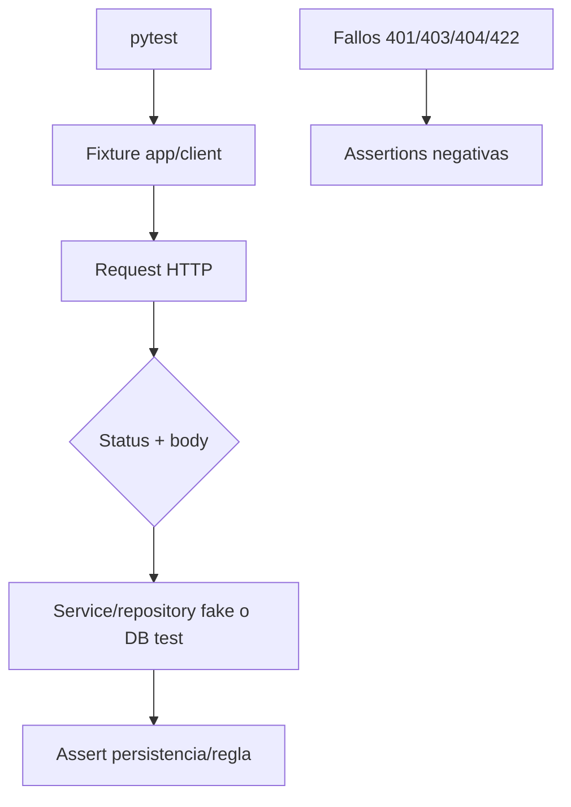

# Diagrama — Issue 09

```mermaid
flowchart TD
 A[pytest] --> B[Fixture app/client]
 B --> C[Request HTTP]
 C --> D{Status + body}
 D --> E[Service/repository fake o DB test]
 E --> F[Assert persistencia/regla]
 G[Fallos 401/403/404/422] --> H[Assertions negativas]
```

Antes: revisión manual y regresiones silenciosas. Después: comportamiento documentado como tests ejecutables.

