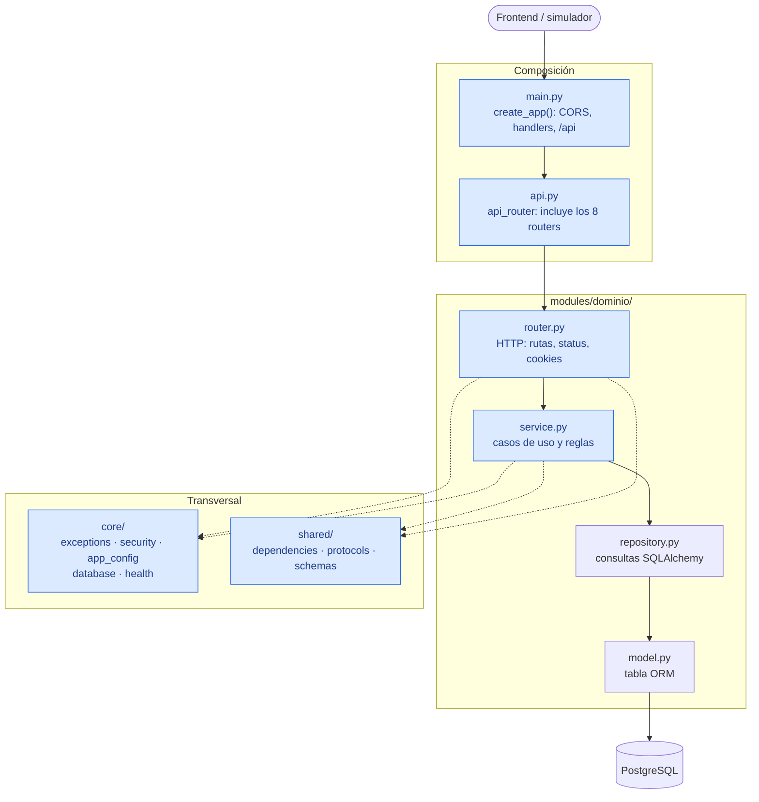
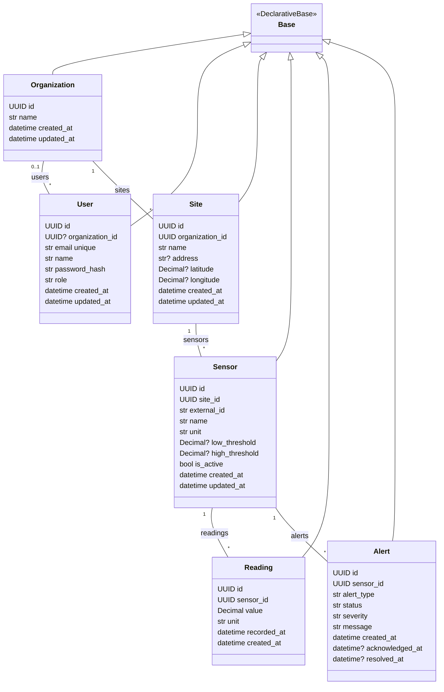
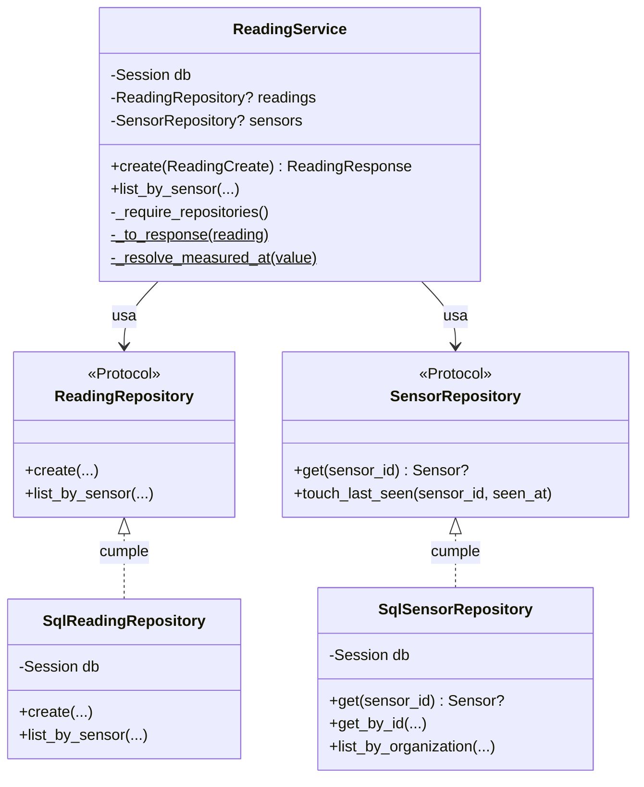
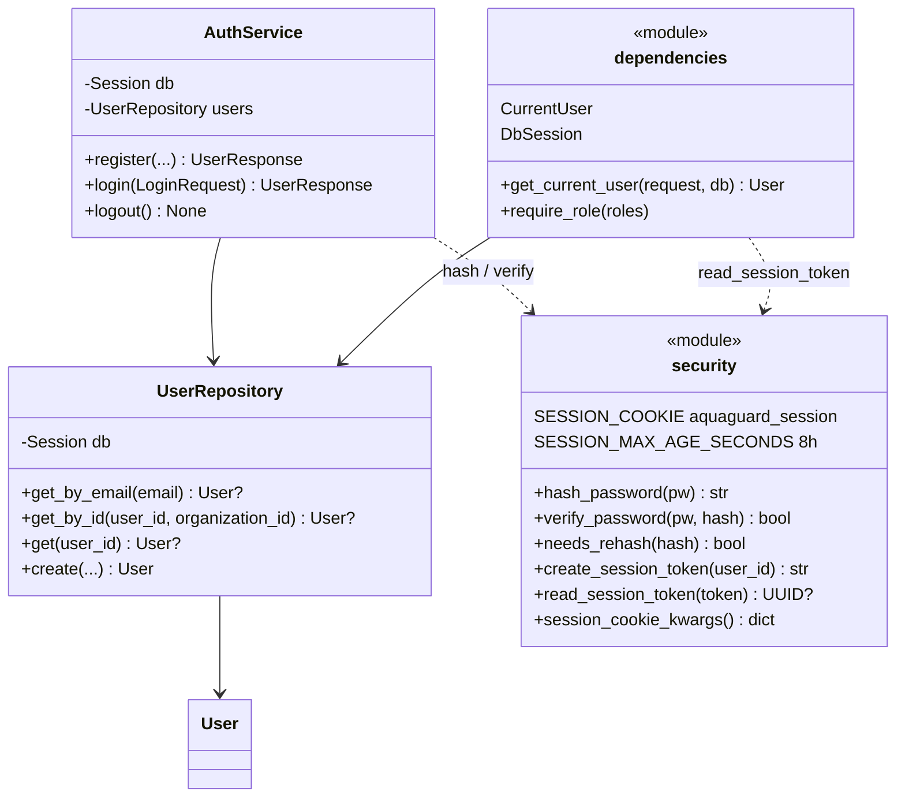
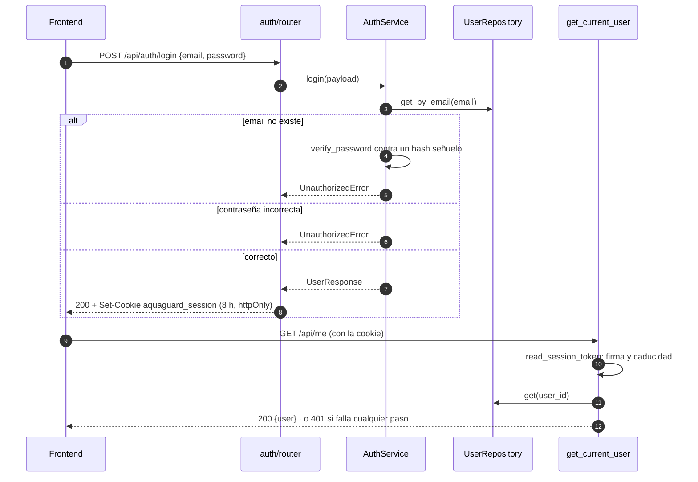
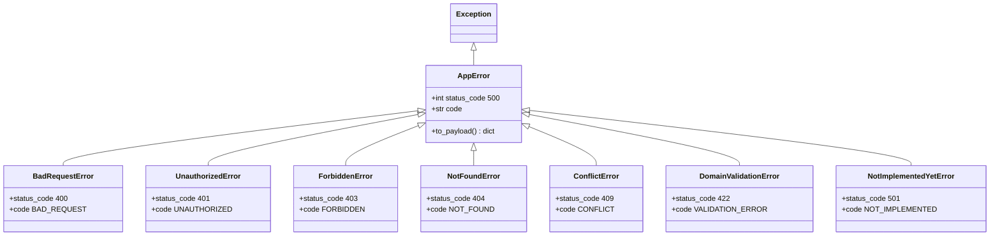

# Arquitectura del backend

Mapa de lo que hay en `backend/app`, centrado en la parte de Ana: la
estructura modular (#22), los errores unificados, `POST /api/readings` (#24)
y la sesión por cookie (#26).

Cinco vistas, de lo general a lo concreto. Los schemas Pydantic se dejan fuera
a propósito: son más de treinta y no cambian la forma del diagrama.

Para navegar el código mientras se lee: en PyCharm Professional, clic derecho
sobre un paquete → *Diagrams → Show Diagram* (`Ctrl+Alt+Shift+U`).

---

## 1. Capas

Cada petición baja por las mismas capas. Cada una solo conoce a la de abajo:
el router habla HTTP, el service tiene las reglas y el repository habla SQL.

En azul, lo que ha montado Ana: la composición, los routers y services, y
lo transversal (`exceptions`, `security`, `app_config`, `health`, `shared`).
`core/database.py`, los repositories y los modelos son de Daruny.

Los 8 módulos de dominio siguen esta forma: `auth`, `users`, `organizations`,
`sites`, `sensors`, `readings`, `alerts` y `analytics`.

---

## 2. Modelos ORM

Todas las tablas heredan de `Base` (`core/database.py`) y usan `UUID` como
clave primaria. Las claves foráneas llevan `ondelete="RESTRICT"`: no se puede
borrar un sensor que tenga lecturas, ni una organización que tenga sites.

`User.organization_id` es opcional: un usuario puede existir sin organización
(p. ej. recién registrado). El resto de relaciones son obligatorias.

---

## 3. Readings: el service depende de contratos, no de SQL

`ReadingService` no importa los repositories de SQLAlchemy. Declara lo que
necesita con dos `Protocol` en `shared/protocols.py`, y quien lo construye
(`get_reading_service`) le pasa las clases concretas. Así los tests le dan
repositories en memoria y prueban las reglas sin PostgreSQL.

`SqlReadingRepository` y `SqlSensorRepository` son los repositories concretos de
`modules/readings/repository.py` y `modules/sensors/repository.py`. En el código
se llaman igual que los Protocol y se importan con el alias `Sql*` en
`get_reading_service`, que es el nombre que se usa aquí.

Qué hace `create()` con un `POST /api/readings`:

1. Busca el sensor con `sensors.get()`. Si no existe → `NotFoundError`
   con `code="SENSOR_NOT_FOUND"`.
2. Resuelve `measured_at`: el que llega, o la hora actual en UTC.
3. Guarda dentro de `transaction(db)`. La unidad sale del sensor, no de una
   constante.
4. Devuelve `201` con la lectura.

Aquí se traduce el vocabulario: el contrato HTTP dice `pressure` y
`measured_at`, y la tabla guarda `value`, `unit` y `recorded_at`.

---

## 4. Auth: sesión por cookie firmada

`AuthService` solo hace negocio (comprobar credenciales, registrar). La cookie
la pone el router, porque es HTTP. `get_current_user` es la dependencia que
usan las rutas protegidas. `core/security.py` y `get_current_user` son
funciones, no clases, por eso aparecen como módulos.

El recorrido de una sesión:

Decisiones que se ven en el diagrama:

- **Hash señuelo:** si el email no existe se verifica igualmente, para que el
  tiempo de respuesta no delate qué cuentas existen. El mensaje es el mismo
  en los dos casos.
- **Se relee el usuario en cada petición:** la cookie solo lleva el id, así
  que un cambio de rol o una baja se aplican en la petición siguiente.
- **`logout()` no revoca:** la sesión no tiene estado (ADR 0001). Una cookie
  copiada vale hasta que caduca. El método existe para poner ahí la
  revocación el día que haga falta.

---

## 5. Errores

Cada error de negocio es una subclase de `AppError` que ya sabe su código HTTP
y su `code`. `register_exception_handlers()` los convierte todos en la misma
forma de respuesta (`ErrorResponse`), así el frontend los trata igual.

El `code` se puede afinar al lanzar el error: `NotFoundError(...,
code="SENSOR_NOT_FOUND")` sigue siendo un 404, pero el frontend puede
distinguirlo.
