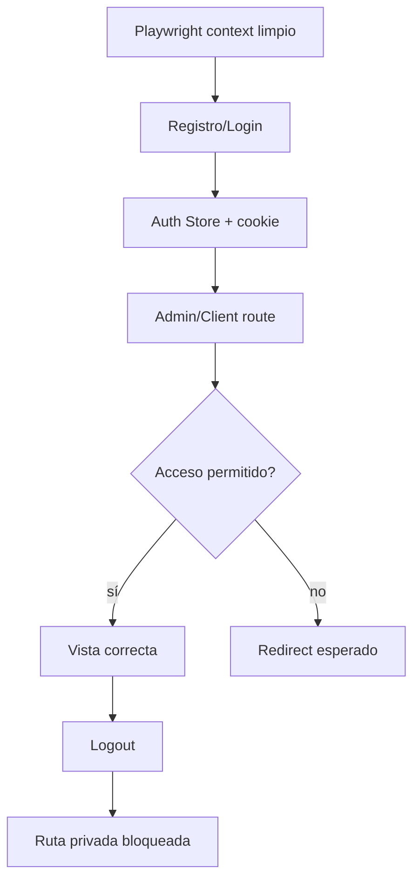

# Diagrama — Issue 11

Antes: auth y navegación comprobadas manualmente. Después: recorrido reproducible y automatizado.

El contexto limpio evita que una cookie o usuario de otro escenario altere el resultado.
