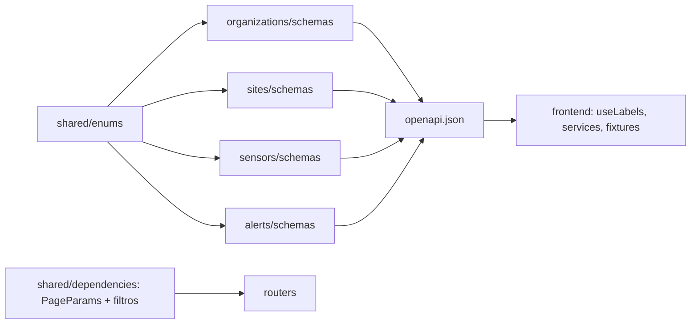
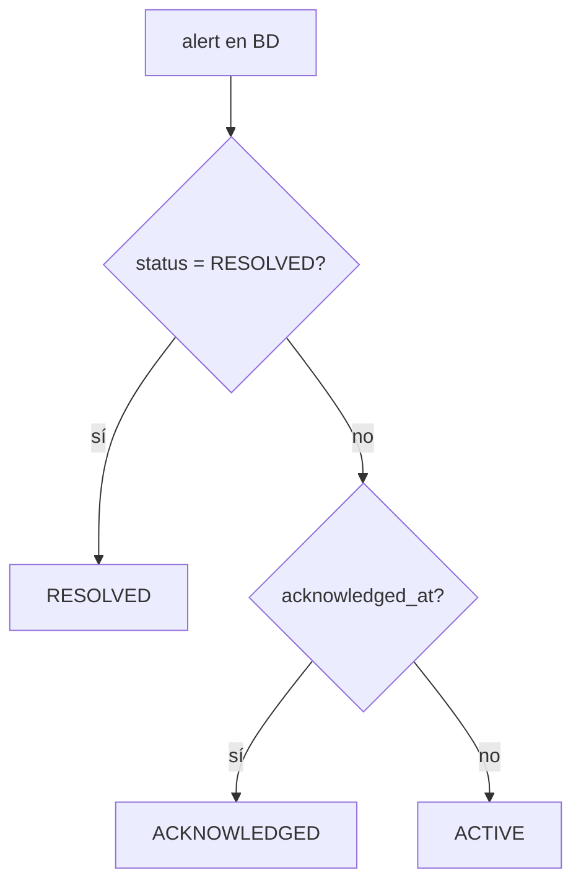

# Diagrama — Issue 12 (B0)

Antes: cada módulo con sus valores y respuestas solo con IDs.
Después: un vocabulario común que el frontend puede mockear sin esperar a B1–B10.

## Estado derivado de una alerta

