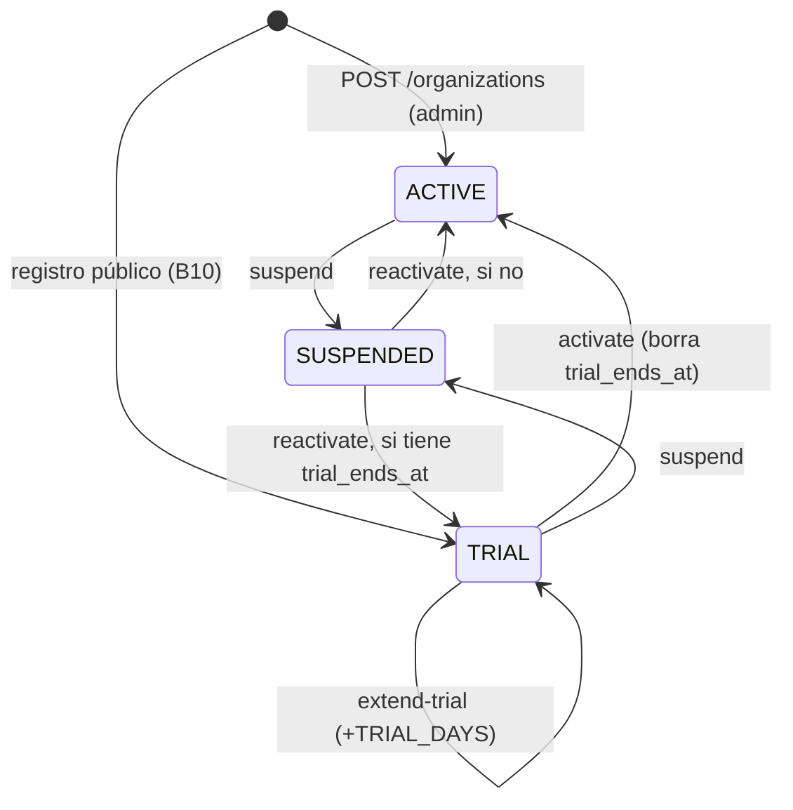
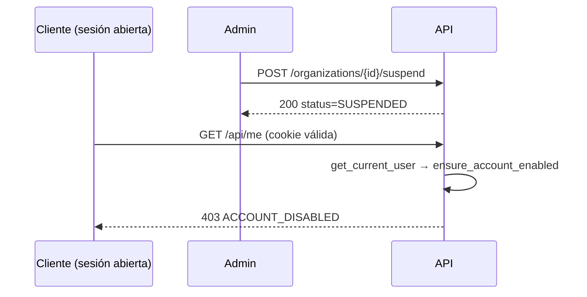
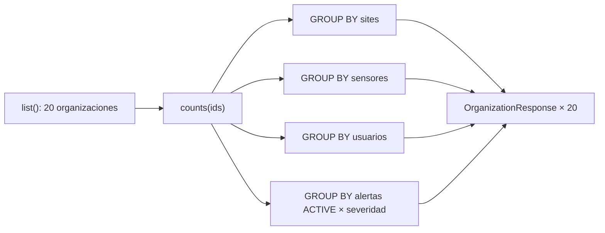

# Diagrama — Issue 13 (B1)

## Estados de una organización

Cualquier otra transición → **409** (`ORGANIZATION_ALREADY_SUSPENDED`,
`ORGANIZATION_NOT_SUSPENDED`, `ORGANIZATION_NOT_IN_TRIAL`).

## Suspender deja fuera a los usuarios

## Contadores sin N+1

