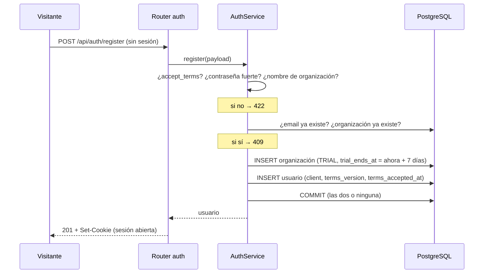
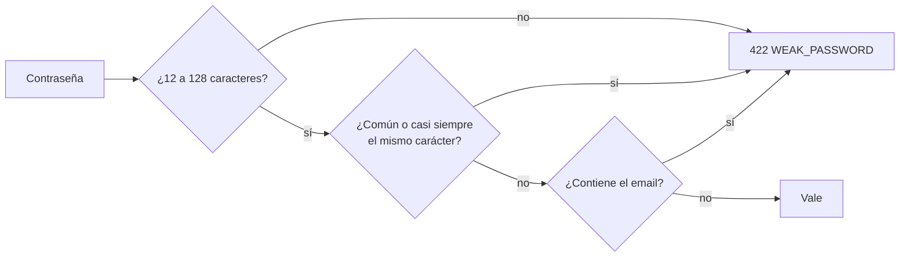

# Diagrama — Issue 16 (B10)

## Registro

```mermaid
sequenceDiagram
  participant V as Visitante
  participant R as Router auth
  participant S as AuthService
  participant DB as PostgreSQL
  V->>R: POST /api/auth/register (sin sesión)
  R->>S: register(payload)
  S->>S: ¿accept_terms? ¿contraseña fuerte? ¿nombre de organización?
  Note over S: si no → 422
  S->>DB: ¿email ya existe? ¿organización ya existe?
  Note over S: si sí → 409
  S->>DB: INSERT organización (TRIAL, trial_ends_at = ahora + 7 días)
  S->>DB: INSERT usuario (client, terms_version, terms_accepted_at)
  S->>DB: COMMIT (las dos o ninguna)
  S-->>R: usuario
  R-->>V: 201 + Set-Cookie (sesión abierta)
```

## Regla de contraseñas

```mermaid
flowchart LR
  P["Contraseña"] --> L{"¿12 a 128 caracteres?"}
  L -- no --> W["422 WEAK_PASSWORD"]
  L -- sí --> C{"¿Común o casi siempre<br/>el mismo carácter?"}
  C -- sí --> W
  C -- no --> E{"¿Contiene el email?"}
  E -- sí --> W
  E -- no --> OK["Vale"]
```
