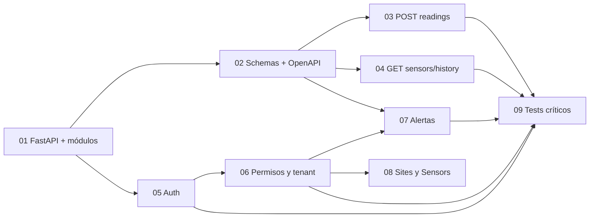

# Documentación de issues de Ana

Esta documentación corresponde a las 9 issues definidas en [`scripts/create_ana_issues.sh`](../../scripts/create_ana_issues.sh). Cada carpeta contiene:

- `01-issue.md`: contexto, objetivo, límites, dependencias y aceptación.
- `02-conceptos.md`: conceptos aislados y relacionados, con tiempo de aprendizaje.
- `03-diagrama.md`: flujo antes/después en Mermaid.
- `04-implementacion.md`: implementación por fases, pruebas y errores frecuentes.

## Orden recomendado

Las issues 03, 04, 07 y 08 dependen de modelos/repositories de Daruny. La issue 09 se construye progresivamente conforme existan rutas y reglas que probar.
