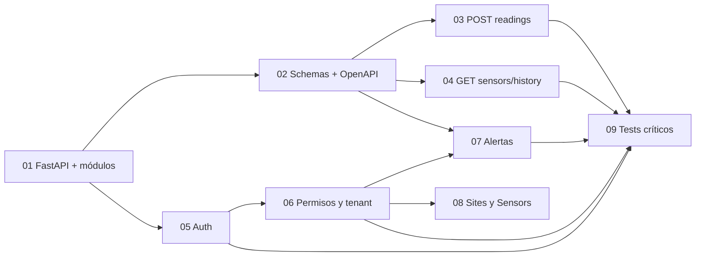

# Documentación de issues de Ana

Backend API y lógica de negocio. Corresponde a las 9 issues definidas en
[`scripts/create_ana_issues.sh`](../../scripts/create_ana_issues.sh)
(GitHub #22 a #30). Cada carpeta contiene:

- `01-issue.md`: contexto, objetivo, límites, dependencias y aceptación.
- `02-conceptos.md`: conceptos aislados y relacionados, con tiempo de aprendizaje.
- `03-diagrama.md`: flujo antes/después en Mermaid.
- `04-implementacion.md`: **los pasos que se han seguido**, decisiones tomadas y qué queda pendiente.

## Estado

| Carpeta | Issue | Estado |
|---|---|---|
| [01-fastapi-modular](01-fastapi-modular/) | #22 | ✅ Hecha — arranca, 8 routers, errores unificados |
| [02-schemas-openapi](02-schemas-openapi/) | #23 | ✅ Hecha — 32 schemas en OpenAPI |
| [03-post-readings](03-post-readings/) | #24 | ⏸ Estructura y contrato listos; **bloqueada por la #14** (repository de Daruny) |
| [04-get-sensors-history](04-get-sensors-history/) | #25 | Pendiente |
| [05-auth](05-auth/) | #26 | Pendiente |
| [06-permissions-tenant](06-permissions-tenant/) | #27 | Pendiente |
| [07-alert-rules](07-alert-rules/) | #28 | Pendiente |
| [08-sites-sensors](08-sites-sensors/) | #29 | Pendiente |
| [09-critical-tests](09-critical-tests/) | #30 | Pendiente |

### Lo que hay publicado hoy

```
GET  /api/health        · liveness, sin base de datos      (#22)
GET  /api/health/db     · readiness, SELECT 1              (#22)
POST /api/readings      · contrato listo, 501 hasta la #14 (#24)
GET  /api/docs          · Swagger
GET  /api/openapi.json  · el contrato (#23)
```

Los contratos de Auth, Users, Sites, Sensors y Alerts están definidos y
visibles en la sección **Schemas** de Swagger aunque sus rutas aún no
existan, para que el frontend pueda construir el `MockAdapter` sin
esperar. Ver [`app/openapi.py`](../../backend/app/openapi.py).

## Cómo levantarlo

```bash
cd backend
python3 -m venv .venv && source .venv/bin/activate
pip install -r requirements.txt
cp ../.env.example .env          # rellenar los valores
uvicorn app.main:app --reload --port 8000
```

Swagger en <http://localhost:8000/api/docs>.

### Configuración: un archivo por dueño

| Archivo | Dueño | Variables |
|---|---|---|
| `core/config.py` | Daruny | `POSTGRES_*` |
| `core/app_config.py` | Ana | `SECRET_KEY`, `COOKIE_SECURE`, `CORS_ORIGINS`, `ENV` |

Las dos clases leen el mismo `.env` y cada una toma lo suyo. Separadas a
propósito, para que dos personas no editen el mismo archivo durante seis
semanas.

## Convenios del contrato

Fijados en la issue #23 y válidos para toda la API:

- Campos en `snake_case`, enums en `UPPER_SNAKE_CASE`.
- Fechas ISO-8601 UTC terminadas en `Z`.
- Paginación `?page=&page_size=` → `{items, total, page, page_size, pages}`.
- Un único formato de error, con `code` estable:
  `{"error": {"code", "message", "details"}}`.

## Reparto con Daruny

Según el apartado 8.1 del documento de arquitectura:

| Capa | Dueño |
|---|---|
| `router.py`, `service.py`, `schemas.py` | **Ana** |
| `model.py`, `repository.py`, `database.py`, migraciones, seeds | **Daruny** |

## Decisiones abiertas

| Con | Qué | Cuándo cierra |
|---|---|---|
| Daruny | `measured_at` además de `created_at` en `readings` | Antes de la 1ª migración (#12, #13) |
| Daruny | `acknowledged_at` en `alerts` | Antes de la 1ª migración (#13, #18) |
| Lylia | `details` del error: ¿lista u objeto? | Antes del interceptor (#32) |

## Orden recomendado



Las issues 03, 04, 07 y 08 dependen de modelos/repositories de Daruny. La
issue 09 se construye progresivamente conforme existan rutas y reglas que
probar.
