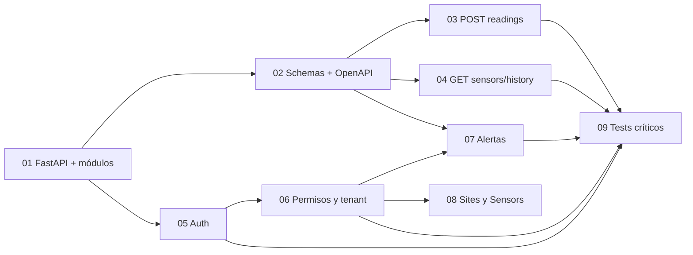

# Documentación de issues de Ana

Backend API y lógica de negocio. Dos tandas: las 9 issues de
[`scripts/create_ana_issues.sh`](../../scripts/create_ana_issues.sh)
(GitHub #22 a #30, todas hechas) y las del rediseño de pantallas (B0 a
B17, GitHub #138 a #150). Cada carpeta contiene:

- `01-issue.md`: contexto, objetivo, límites, dependencias y aceptación.
- `02-conceptos.md`: conceptos aislados y relacionados, con tiempo de aprendizaje.
- `03-diagrama.md`: flujo antes/después en Mermaid.
- `04-implementacion.md`: **los pasos que se han seguido**, decisiones tomadas y qué queda pendiente.

## Estado

| Carpeta | Issue | Estado |
|---|---|---|
| [01-fastapi-modular](01-fastapi-modular/) | #22 | ✅ Hecha — arranca, 8 routers, errores unificados |
| [02-schemas-openapi](02-schemas-openapi/) | #23 | ✅ Hecha — 32 schemas en OpenAPI |
| [03-post-readings](03-post-readings/) | #24 | ✅ Hecha — más la clave del simulador `X-Ingest-Key` (#106) |
| [04-get-sensors-history](04-get-sensors-history/) | #25 | ✅ Hecha — GET sensores y histórico de lecturas |
| [05-auth](05-auth/) | #26 | ✅ Hecha — registro, login, logout y /api/me con cookie |
| [06-permissions-tenant](06-permissions-tenant/) | #27 | ✅ Hecha — `require_role`, aislamiento por organización |
| [07-alert-rules](07-alert-rules/) | #28 | ✅ Hecha — LOW/HIGH_PRESSURE, SENSOR_OFFLINE, listar/reconocer/resolver |
| [08-sites-sensors](08-sites-sensors/) | #29 | ✅ Hecha — sites, sensores de un site, alta y edición |
| [09-critical-tests](09-critical-tests/) | #30 | ✅ Hecha — tests de health, token y rutas críticas |

### Segunda tanda: rediseño de pantallas (creada el 2026-10-08)

| Carpeta | Issue | Prio | Qué | Depende de | Estado |
|---|---|---|---|---|---|
| [12-contrato-comun-b0](12-contrato-comun-b0/) | #138 | P1 | B0 — Enums, filtros, paginación, campos `*_name` | — | ✅ Hecha (PR #180) |
| [13-organizaciones-b1](13-organizaciones-b1/) | #139 | P1 | **B1** — Organizaciones (absorbe #121) | B0 ✅, D0-D2 ✅ | 🚧 En curso (rama `ana/139-b1-organizaciones`) |
| — | #139 | P1 | B2 — Edificios con plantas y tipo · B3 — Sensores con planta y health | B1 | Pendiente |
| — | #143 | P1 | B7 — Series de 7 días para gráficas | — | Pendiente (paralelo) |
| — | #140 | P1 | B10 — Registro público con prueba de 7 días | B0, B1, I0 (#151) | Pendiente |
| — | #142 | P1 | B5 — Alertas: filtros, ACKNOWLEDGED, quién actuó | B0, B3 | Pendiente |
| — | #141 | P1 | B4+B6 — Invitaciones y gestión de usuarios | B1, B10, D3 (#130), I0 | Pendiente |
| — | #144 | P1 | B8+B9 — Mi cuenta y KPIs | B5, B6 | Pendiente |
| — | #146 | P2 | B12 — Prueba caducada: solo lectura | B10 | Pendiente |
| — | #145 | P2 | B16 — Eliminar organización | D9 (#133) | Pendiente |
| — | #147 | P2 | B11 — Documentos por edificio | D4 (#132) | Pendiente |
| — | #148 | P2 | B13 — OpenAPI completo con ejemplos | todo lo anterior | Pendiente |
| — | #149 | P3 | B15 — Exportar mis datos / baja | — | Pendiente |
| — | #150 | P3 | B14+B17 — Suscripción y búsqueda global (opcional) | — | Pendiente |

Orden: B0 → B1+B2+B3 (con B7 en paralelo) → B10 → B5 → B4+B6 → B8+B9 → P2 → P3.

## Cómo levantarlo

```bash
cd backend
python3 -m venv .venv && source .venv/bin/activate
pip install -r requirements.txt
cp ../.env.example .env          # rellenar los valores
uvicorn app.main:app --reload --port 8000
```

Swagger en <http://localhost:8000/api/docs>.

### Configuración: un archivo por dueño

| Archivo | Dueño | Variables |
|---|---|---|
| `core/config.py` | Daruny | `POSTGRES_*` |
| `core/app_config.py` | Ana | `SECRET_KEY`, `COOKIE_SECURE`, `CORS_ORIGINS`, `ENV` |

Las dos clases leen el mismo `.env` y cada una toma lo suyo. Separadas a
propósito, para que dos personas no editen el mismo archivo durante seis
semanas.

## Convenios del contrato

Fijados en la issue #23 y válidos para toda la API:

- Campos en `snake_case`, enums en `UPPER_SNAKE_CASE`.
- Fechas ISO-8601 UTC terminadas en `Z`.
- Paginación `?page=&page_size=` → `{items, total, page, page_size, pages}`.
- Un único formato de error, con `code` estable:
  `{"error": {"code", "message", "details"}}`.

## Reparto con Daruny

Según el apartado 8.1 del documento de arquitectura:

| Capa | Dueño |
|---|---|
| `router.py`, `service.py`, `schemas.py` | **Ana** |
| `model.py`, `repository.py`, `database.py`, migraciones, seeds | **Daruny** |

## Decisiones tomadas

Las que estaban abiertas al empezar la primera tanda, ya cerradas:

| Con | Qué | Cómo quedó |
|---|---|---|
| Daruny | Fecha de medida en `readings` | Columna `recorded_at` (el contrato la llama `measured_at`), además de `created_at` |
| Daruny | `acknowledged_at` en `alerts` | Existe. Desde la B0 la respuesta trae también `state` calculado |
| Lylia | `details` del error: ¿lista u objeto? | Lista de `{field, message, type}`, o `null` |

Cada carpeta tiene al final de su `04-implementacion.md` una sección
**«Lo que se hizo de verdad»** con las PRs y las decisiones finales.

## Orden recomendado


```mermaid
flowchart LR
 I01[01 FastAPI + módulos] --> I02[02 Schemas + OpenAPI]
 I02 --> I03[03 POST readings]
 I02 --> I04[04 GET sensors/history]
 I01 --> I05[05 Auth]
 I05 --> I06[06 Permisos y tenant]
 I02 --> I07[07 Alertas]
 I06 --> I07
 I06 --> I08[08 Sites y Sensors]
 I03 --> I09[09 Tests críticos]
 I04 --> I09
 I05 --> I09
 I06 --> I09
 I07 --> I09
```

Las issues 03, 04, 07 y 08 dependen de modelos/repositories de Daruny. La
issue 09 se construye progresivamente conforme existan rutas y reglas que
probar.
