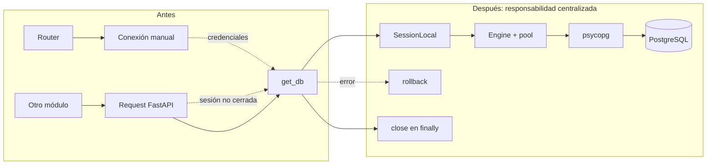
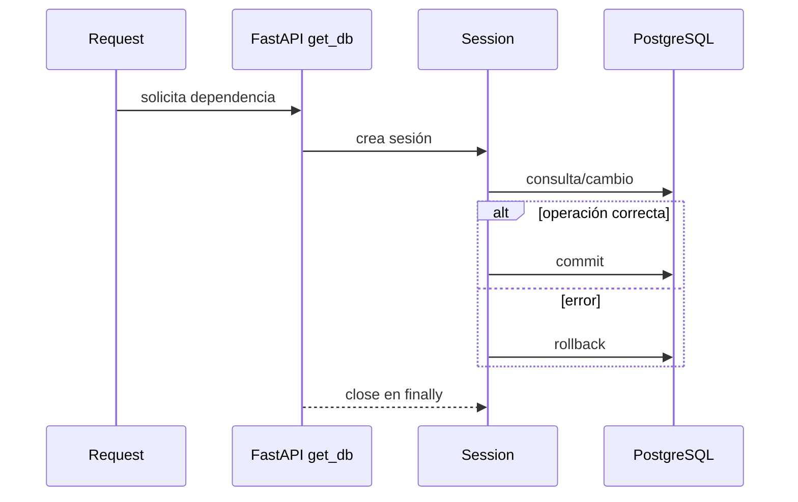

# Diagrama — Issue 01

## Antes: conexión sin responsabilidad clara

## Ciclo de una request

La aplicación nunca debe abrir conexiones manuales desde routers ni imprimir la URL completa con contraseña.
