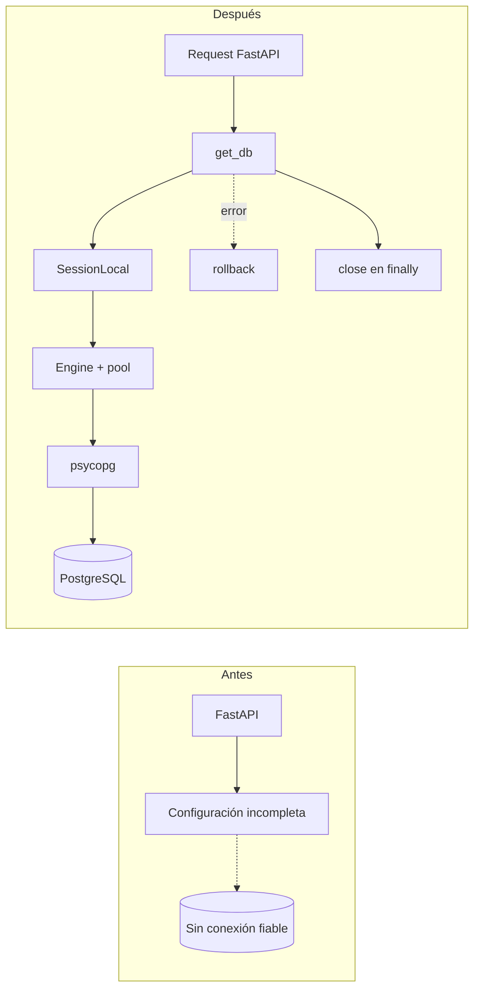

# Diagrama — Issue 01

## Antes y después

```mermaid
flowchart LR
 subgraph Antes[Antes]
  A[FastAPI] --> B[Configuración incompleta]
  B -.-> C[(Sin conexión fiable)]
 end
 subgraph Despues[Después]
  D[Request FastAPI] --> E[get_db]
  E --> F[SessionLocal]
  F --> G[Engine + pool]
  G --> H[psycopg]
  H --> I[(PostgreSQL)]
  E -. error .-> J[rollback]
  E --> K[close en finally]
 end
```

La aplicación nunca debe abrir conexiones manuales desde routers ni imprimir la URL completa con contraseña.

