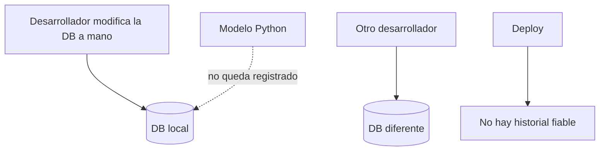
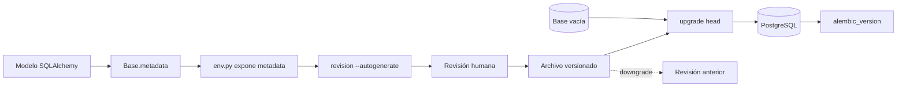

# Diagrama — Issue 02

## Antes: cambios manuales y estados divergentes

## Después: esquema reproducible

## Lectura del flujo

1. El modelo describe el estado deseado.
2. `env.py` conecta Alembic con la configuración y la metadata.
3. Alembic propone una revisión.
4. El desarrollador revisa si el cambio es correcto y seguro.
5. El archivo se versiona junto al código.
6. Cada entorno aplica la misma secuencia y registra su posición.
