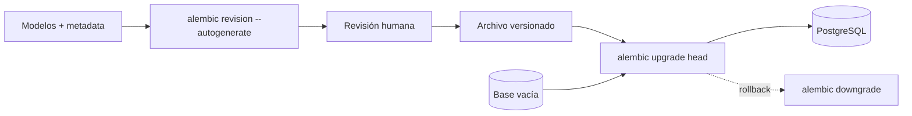

# Diagrama — Issue 02

```mermaid
flowchart LR
 A[Modelos + metadata] --> B[alembic revision --autogenerate]
 B --> C[Revisión humana]
 C --> D[Archivo versionado]
 D --> E[alembic upgrade head]
 E --> F[(PostgreSQL)]
 G[(Base vacía)] --> E
 E -. rollback .-> H[alembic downgrade]
```

Antes: cada desarrollador modifica la base a mano. Después: el repositorio describe cómo reproducir el esquema.

