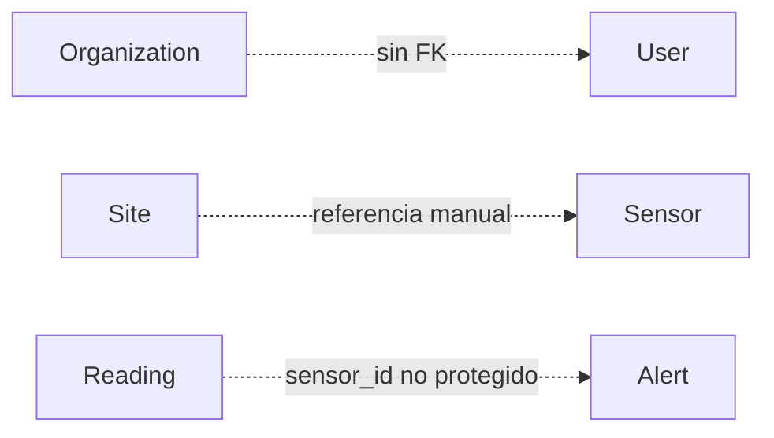
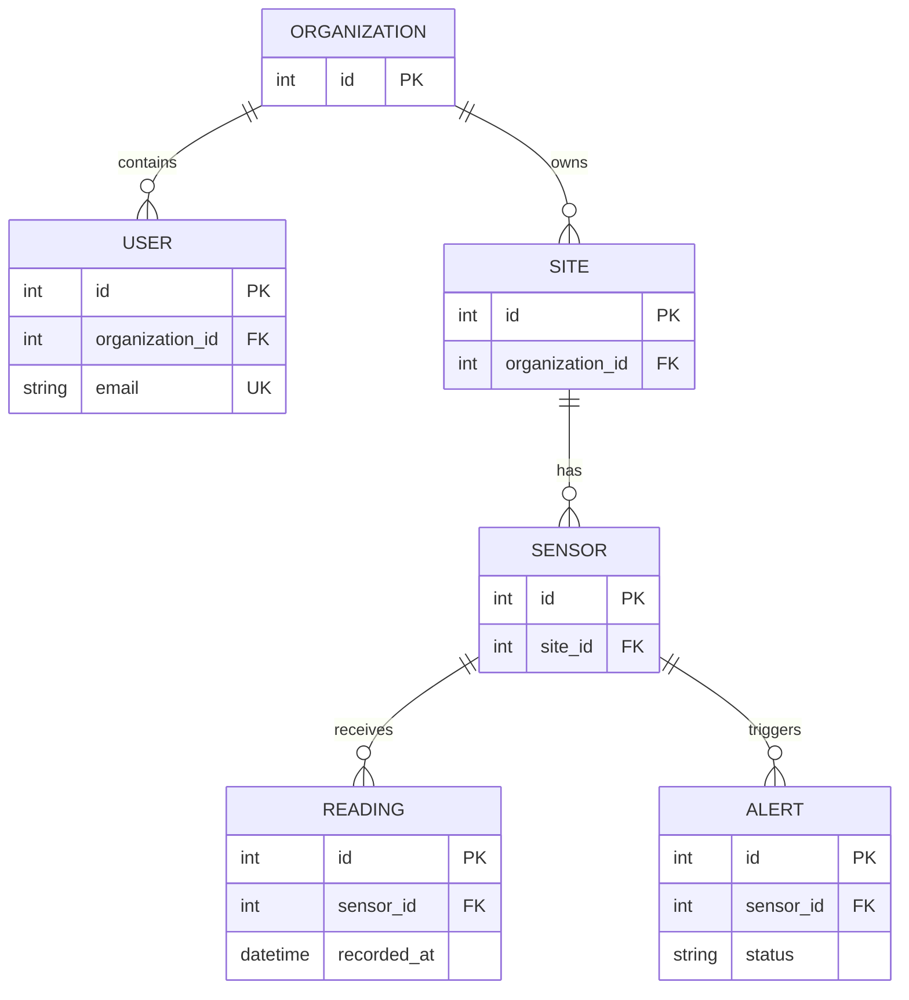
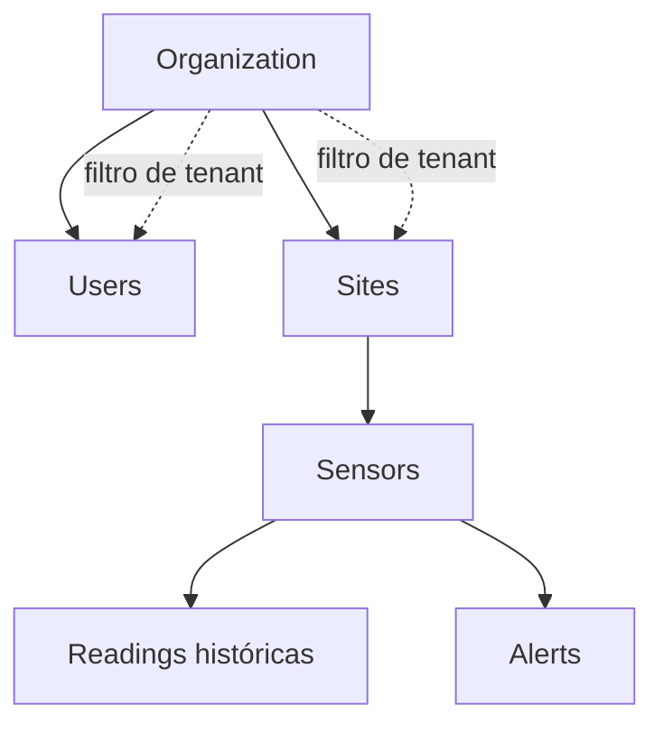

# Diagrama — Issue 03

## Antes: entidades aisladas

## Después: dominio relacional

## Lectura de las relaciones

Las flechas representan pertenencia; el histórico cuelga del sensor y no debe perderse por borrar una entidad sin una política explícita.
