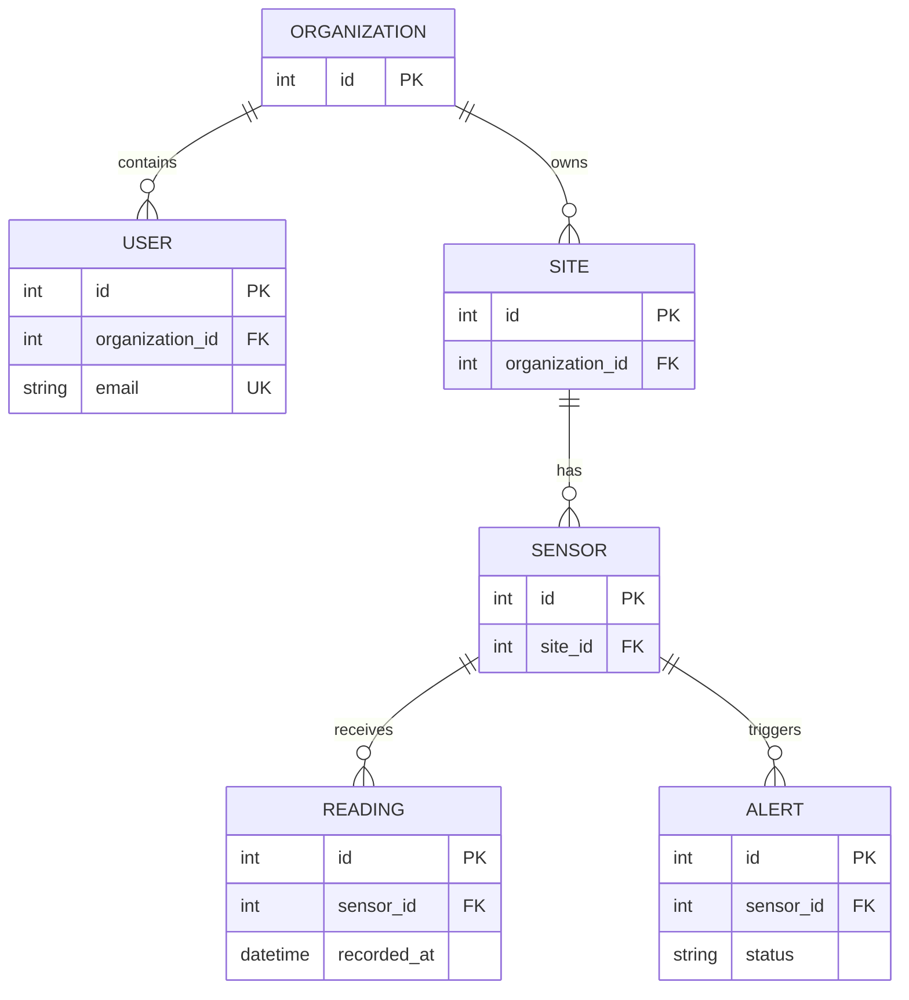

# Diagrama — Issue 03

```mermaid
erDiagram
 ORGANIZATION ||--o{ USER : contains
 ORGANIZATION ||--o{ SITE : owns
 SITE ||--o{ SENSOR : has
 SENSOR ||--o{ READING : receives
 SENSOR ||--o{ ALERT : triggers
 ORGANIZATION { int id PK }
 USER { int id PK int organization_id FK string email UK }
 SITE { int id PK int organization_id FK }
 SENSOR { int id PK int site_id FK }
 READING { int id PK int sensor_id FK datetime recorded_at }
 ALERT { int id PK int sensor_id FK string status }
```

Antes: módulos con entidades aisladas. Después: un dominio conectado mediante FK y relaciones explícitas.

