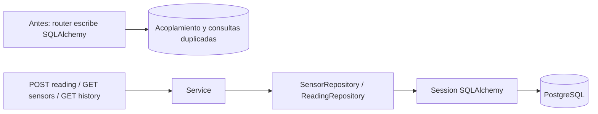

# Diagrama — Issue 04

```mermaid
flowchart LR
 A[Antes: router escribe SQLAlchemy] --> B[(Acoplamiento y consultas duplicadas)]
 C[Service] --> D[SensorRepository / ReadingRepository]
 D --> E[Session SQLAlchemy]
 E --> F[(PostgreSQL)]
 G[POST reading / GET sensors / GET history] --> C
```

Después, los routers solo reciben peticiones y los services coordinan; el repository concentra persistencia.

