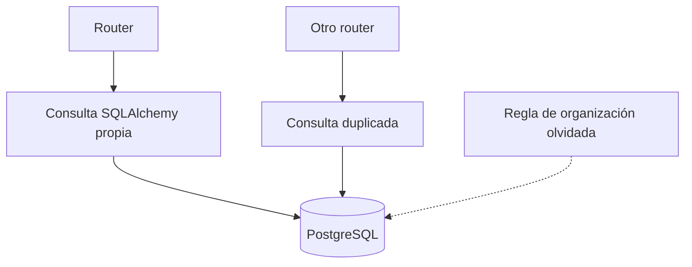
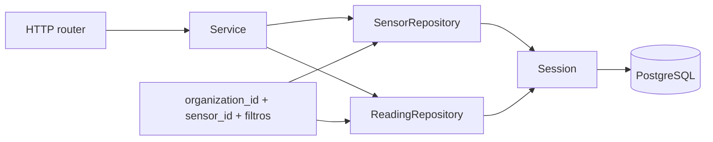

# Diagrama — Issue 04

## Antes: persistencia mezclada con HTTP

## Después: capas con responsabilidades claras

Los routers solo reciben peticiones; services coordinan; repositories concentran consultas y la session ejecuta la transacción.
