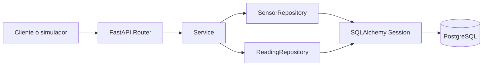
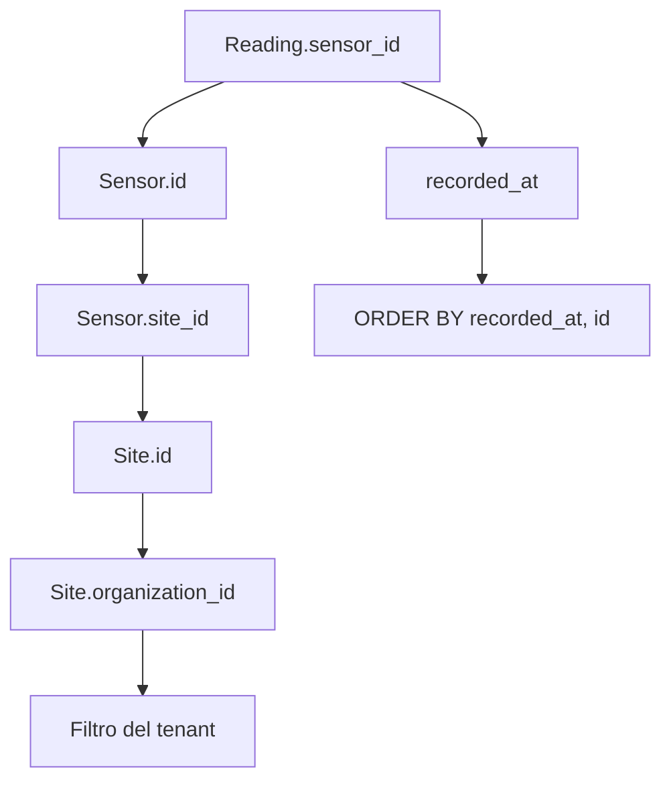
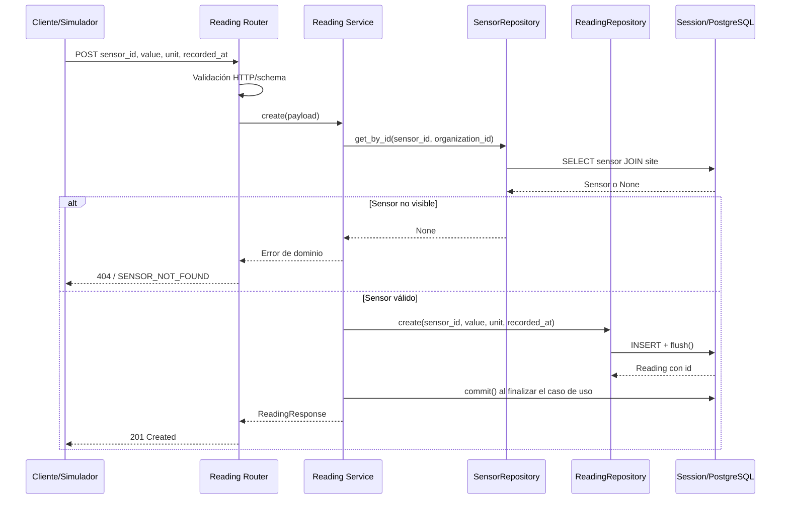
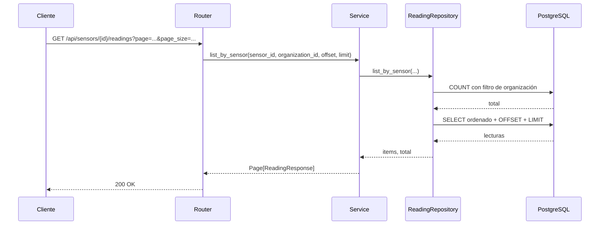
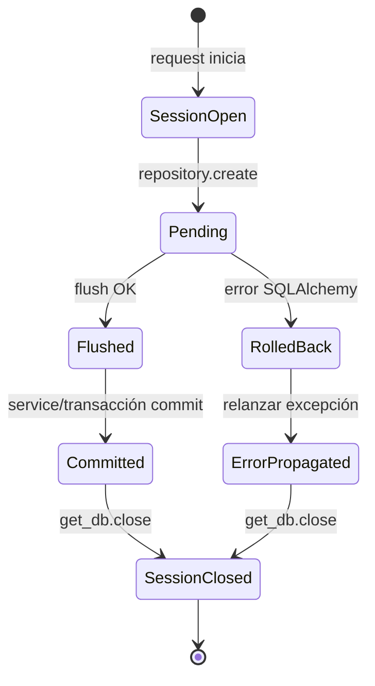
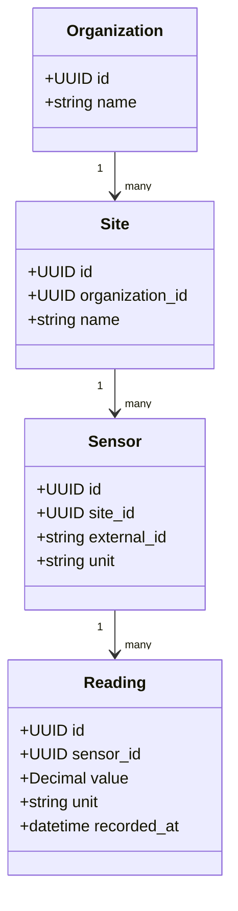

# Artifact — Repositories de Sensors y Readings

> Estado revisado contra el repositorio actual: 5 de septiembre de 2026.
> Este documento describe tanto la implementación presente como los bloqueos
> que todavía impiden considerar operativo el flujo vertical completo.

## 1. Propósito

Este documento explica la implementación de la Issue 04 y sirve como contrato
de integración para los services y routers de Ana.

El objetivo es concentrar el acceso a PostgreSQL mediante SQLAlchemy sin que
las capas superiores conozcan joins, filtros, paginación o detalles de sesión.

La implementación actual se basa en los modelos existentes:

- Las claves primarias son `UUID`, generadas por `uuid.uuid4` y respaldadas en
  PostgreSQL por `gen_random_uuid()`.
- `Sensor` pertenece a `Site` mediante `site_id`.
- `Site` pertenece a `Organization` mediante `organization_id`.
- `Reading` pertenece a `Sensor` mediante `sensor_id`.
- Una lectura utiliza `value`, `unit`, `recorded_at` y `created_at`.

La migración [`713aa912ec73_create_initial_domain_models.py`](../../../backend/migrations/versions/713aa912ec73_create_initial_domain_models.py)
también define los identificadores como `sa.Uuid(as_uuid=True)`, por lo que
la migración y los modelos están alineados en este punto.

## 2. Flujo general de capas



| Capa | Responsabilidad | No debe hacer |
|---|---|---|
| Router | Recibir HTTP, validar entrada y devolver respuesta | Construir `select`, joins o reglas de negocio |
| Service | Coordinar el caso de uso, autorización y conversión a schema | Conocer detalles de SQLAlchemy |
| Repository | Consultar y persistir entidades | Devolver respuestas HTTP o reglas de negocio |
| Session/transacción | Ejecutar `flush`, `commit`, `rollback` y `close` | Decidir qué usuario puede ver un recurso |
| PostgreSQL | Integridad referencial, índices y persistencia | Aplicar decisiones de presentación |

### Estado actual de la integración

Los repositories sí contienen las consultas, pero el flujo vertical todavía no
está conectado: `ReadingService` y `SensorService` siguen devolviendo
`NotImplementedYetError`; además, `get_reading_service` y
`get_sensor_service` no construyen repositories concretos. Los diagramas de
secuencia de este documento muestran el flujo objetivo de integración.

## 3. `SensorRepository`

Archivo: [`backend/app/modules/sensors/repository.py`](../../../backend/app/modules/sensors/repository.py)

La firma actualmente escrita en los repositories es la siguiente:

```python
class SensorRepository:
    def __init__(self, db: Session) -> None: ...

    def list_by_organization(
        self, organization_id: int, offset: int = 0, limit: int = 100
    ) -> tuple[list[Sensor], int]: ...

    def get_by_id(
        self, sensor_id: int, organization_id: int
    ) -> Sensor | None: ...
```

Los valores reales que reciben estos métodos deben ser `UUID`, porque así
están definidos `Sensor.id`, `Sensor.site_id` y `Organization.id`. Las
anotaciones `int` del repository son actualmente incorrectas y deben
corregirse a `UUID` antes de integrar type checking o el service.

### `list_by_organization`

- Hace `JOIN` de `sensors` con `sites`.
- Filtra por `sites.organization_id`.
- Calcula el total antes de aplicar paginación.
- Ordena por `sensors.id` para que las páginas sean estables.
- Devuelve `(items, total)`.
- Rechaza `offset < 0` y `limit <= 0` con `ValueError`.

### `get_by_id`

Busca por `sensor_id` y `organization_id` en la misma consulta. Devuelve la
entidad `Sensor` si es visible y `None` si no existe o pertenece a otra
organización. Esto evita revelar si un identificador de otro tenant es válido.

## 4. `ReadingRepository`

Archivo: [`backend/app/modules/readings/repository.py`](../../../backend/app/modules/readings/repository.py)

```python
class ReadingRepository:
    def __init__(self, db: Session) -> None: ...

    def create(
        self, sensor_id: int, value: float, unit: str, recorded_at: datetime
    ) -> Reading: ...

    def list_by_sensor(
        self,
        sensor_id: int,
        organization_id: int,
        offset: int = 0,
        limit: int = 100,
    ) -> tuple[list[Reading], int]: ...
```

Igualmente, `Reading.id` y `Reading.sensor_id` son `UUID` en el modelo, aunque
el repository todavía los anota como `int`. La implementación funcional debe
mantener los nombres del modelo (`value` y `recorded_at`) hasta que se acuerde
un adaptador explícito con el contrato HTTP (`pressure` y `measured_at`).

### Creación de una lectura

`create` construye una entidad `Reading`, la añade a la sesión y ejecuta
`flush()`.

El `flush()` envía el `INSERT`, obtiene el ID generado y no confirma todavía la
transacción. El repository no hace `commit()`: la confirmación pertenece al
caso de uso/request y permite agrupar varias operaciones. Si SQLAlchemy
produce un error durante `flush`, el repository hace `rollback()` y propaga la
excepción original.

### Histórico por sensor



`list_by_sensor` filtra por lectura y organización, calcula el total, ordena
por `recorded_at` y después por `id`, y aplica `offset` y `limit`. Un sensor
inexistente o de otra organización produce `([], 0)`.

## 5. Flujo objetivo de creación de una lectura

El router `POST /api/readings` ya está declarado, pero el service todavía no
ejecuta este flujo. La siguiente secuencia describe cómo debe quedar una vez
realizado el wiring.



La responsabilidad del repository termina en persistir la entidad. La
actualización de estado del sensor, alertas y reglas de presión pertenecen al
service o a casos de uso posteriores.

## 6. Flujo objetivo de consulta del histórico

La ruta `GET /api/sensors/{id}/readings` todavía no está publicada. El router
de sensores tampoco tiene rutas implementadas; esta secuencia documenta el
contrato esperado para la issue posterior que conecte el histórico.



El `organization_id` debe proceder de la identidad autenticada y nunca de un
parámetro controlado por el cliente.

## 7. Transacciones y errores

`get_db()` crea y cierra la sesión, mientras que `transaction(db)` ya ofrece un
context manager con `commit()` en éxito y `rollback()` ante excepción. A día de
hoy ese context manager no está integrado en los services; por eso el commit
que aparece en la secuencia es responsabilidad pendiente del wiring.



| Situación | Comportamiento |
|---|---|
| Sensor de otra organización | `None` en `get_by_id`; histórico vacío |
| Sensor inexistente al consultar histórico | Histórico vacío |
| Paginación inválida | `ValueError` antes de consultar |
| Error SQL durante `create` | `rollback()` y propagación de `SQLAlchemyError` |
| Lectura válida | `Reading` con ID después de `flush()` |
| Confirmación | La realiza la capa transaccional superior |

## 8. Parametrización y seguridad

Todas las consultas utilizan expresiones SQLAlchemy:

```python
where(
    Reading.sensor_id == sensor_id,
    Site.organization_id == organization_id,
)
```

SQLAlchemy genera parámetros enlazados. No se concatenan valores de usuario en
SQL, nombres de tabla ni cláusulas `WHERE`.

El control de tenant se mantiene dentro de la propia consulta, no en una
segunda consulta previa. Así se evita comprobar primero un sensor y consultar
después sus lecturas sin volver a verificar la organización.

## 9. Relación ORM



El estado actual tiene una inconsistencia ORM: `Reading.sensor` declara
`back_populates="readings"`, pero `Sensor` no declara actualmente el atributo
`readings`. Por tanto, el diagrama representa la relación de dominio esperada,
pero el mapeo bidireccional debe completarse antes de ejecutar las pruebas de
persistencia o usar la relación desde SQLAlchemy.

## 10. Pruebas añadidas

Archivo: [`backend/tests/unit/test_sensor_reading_repositories.py`](../../../backend/tests/unit/test_sensor_reading_repositories.py)

Las pruebas añadidas utilizan SQLite en memoria y pretenden verificar:

- aislamiento de sensores por organización;
- ocultación de sensores de otros tenants;
- creación mediante `flush` y generación de ID;
- orden estable cuando dos lecturas comparten timestamp;
- paginación del histórico;
- histórico vacío para una organización incorrecta;
- validación de `offset` y `limit`.

El fixture crea organizaciones, sites y sensores sin IDs explícitos; con los
modelos actuales esos valores son UUID. También importa `User` y `Alert` para
registrar todos los modelos relacionados en `Base.metadata`.

Comandos de validación:

```bash
python3 -m compileall -q backend/app backend/tests
PYTHONPATH=backend pytest -q \
  backend/tests/unit/test_sensor_reading_repositories.py \
  backend/tests/test_imports.py
```

En la última validación disponible, `compileall` fue correcto, pero los tests
no pudieron ejecutarse porque el entorno no tenía instalados `pytest` ni
`SQLAlchemy`. Además, debe corregirse primero la relación ORM indicada en la
sección anterior; de lo contrario, el registro de mappings puede fallar al
crear las entidades.

## 11. Pendientes de integración

Antes de conectar los endpoints, Ana debe alinear los contratos actuales:

| Código actual | Contrato documentado de Ana |
|---|---|
| Modelos y migración usan `UUID` | Los repositories todavía anotan IDs como `int` |
| `value` | `pressure` |
| `recorded_at` | `measured_at` |
| `ReadingRepository.create` | El protocolo antiguo declara `add` |
| `SensorRepository.get_by_id(..., organization_id)` | El protocolo antiguo declara `get(sensor_id)` |

La integración no debe eliminar el parámetro de organización: es parte de la
frontera de seguridad multi-tenant. Tampoco debe darse por completado el
endpoint: `ReadingService` y `SensorService` siguen lanzando
`NotImplementedYetError`, y `get_reading_service` todavía no construye los
repositories concretos.

## 12. Criterio de aceptación de la Issue 04

- [x] Existe implementación de creación de `Reading` en el repository.
- [x] Existe implementación de listado de sensores por organización.
- [x] Existe implementación de histórico ordenado y paginado.
- [x] Los filtros se expresan con parámetros SQLAlchemy.
- [x] La consulta de histórico verifica organización.
- [x] `commit` y `rollback` siguen una política coherente.
- [x] Existen pruebas unitarias escritas para casos felices, límites y aislamiento.
- [ ] Se verifica la relación bidireccional `Sensor.readings`/`Reading.sensor`.
- [ ] Ana alinea annotations, schemas, protocols y services con los modelos.
- [ ] Se conectan los repositories desde `get_reading_service` y `get_sensor_service`.
- [ ] Se ejecutan los tests con dependencias instaladas y PostgreSQL.
