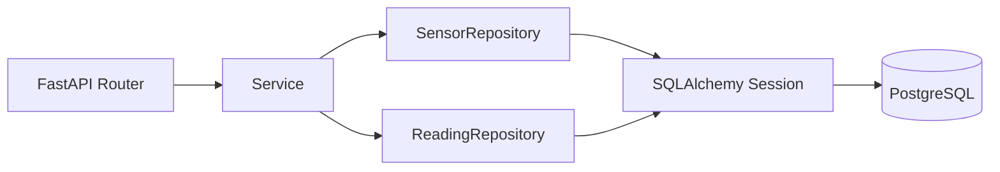
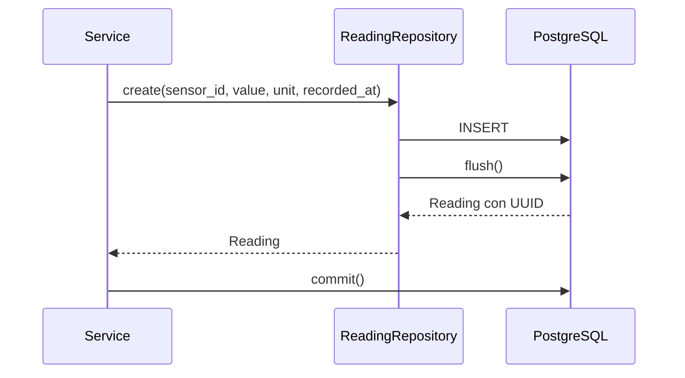
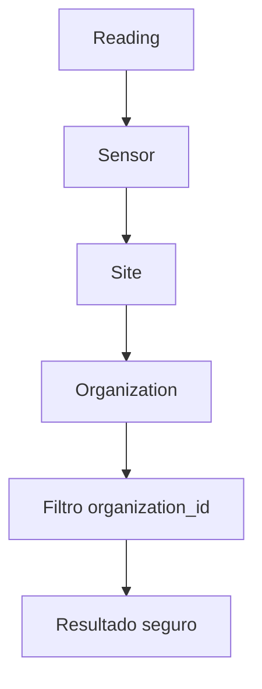

# Issue 04 — Repositories de Sensors y Readings

## Qué hemos implementado

Hemos creado la capa de persistencia para que los services no tengan que
escribir consultas SQLAlchemy directamente.

- `SensorRepository`: lista sensores por organización y busca un sensor de
  forma segura.
- `ReadingRepository`: guarda lecturas y consulta el histórico de un sensor.
- Todas las consultas filtran por `organization_id` para evitar mezclar datos
  entre organizaciones.
- El histórico usa paginación y orden estable por `recorded_at` e `id`.
- `create()` usa `flush()` para obtener el ID sin hacer `commit()` dentro del
  repository.
- Si falla el `flush()`, se ejecuta `rollback()`.
- Se completó la relación ORM `Sensor.readings` ↔ `Reading.sensor`.

## Flujo de la aplicación

El router recibe la petición, el service coordina el caso de uso y el
repository realiza el acceso a datos.

## Guardar una lectura

El repository no decide reglas de negocio ni devuelve respuestas HTTP. Solo
persiste entidades y devuelve resultados.

## Consultar sensores e histórico

El histórico no consulta únicamente por `sensor_id`: también verifica que el
sensor pertenece a la organización solicitante.

## Archivos modificados

- `backend/app/modules/sensors/repository.py`
- `backend/app/modules/readings/repository.py`
- `backend/app/modules/sensors/model.py`

## Pendiente

Los repositories están implementados, pero todavía falta conectarlos a los
services y ejecutar los tests con las dependencias y PostgreSQL disponibles.
