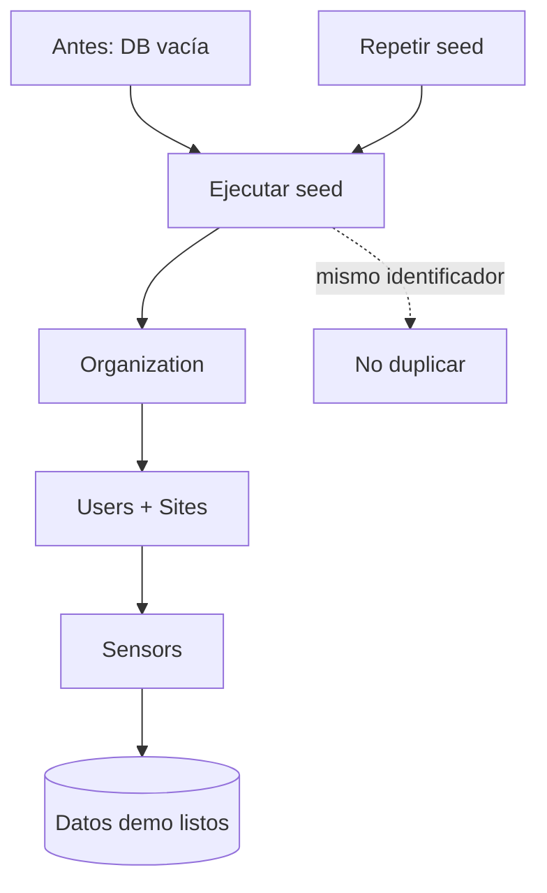

# Diagrama — Issue 05

```mermaid
flowchart TD
 A[Antes: DB vacía] --> B[Ejecutar seed]
 B --> C[Organization]
 C --> D[Users + Sites]
 D --> E[Sensors]
 E --> F[(Datos demo listos)]
 G[Repetir seed] --> B
 B -. mismo identificador .-> H[No duplicar]
```
