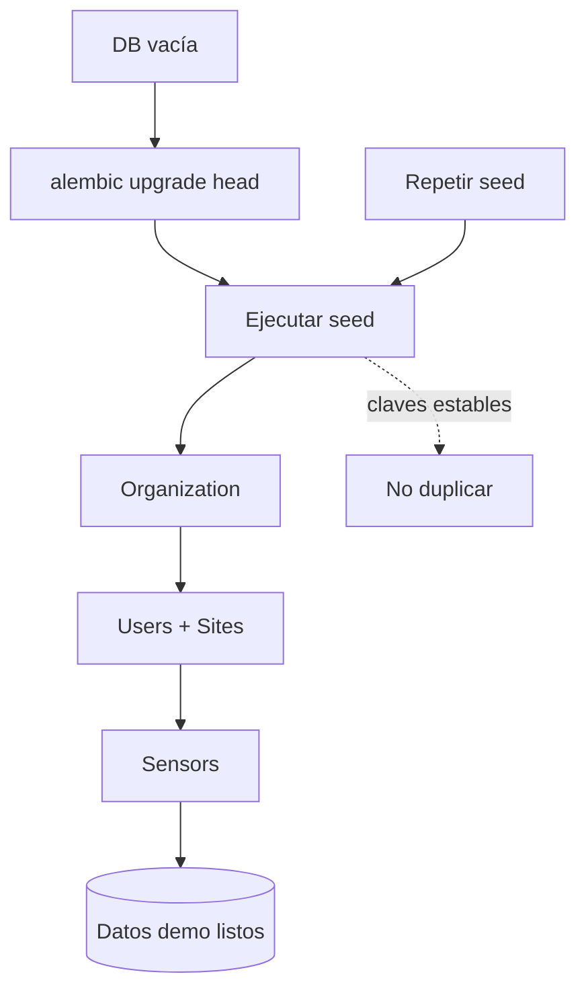
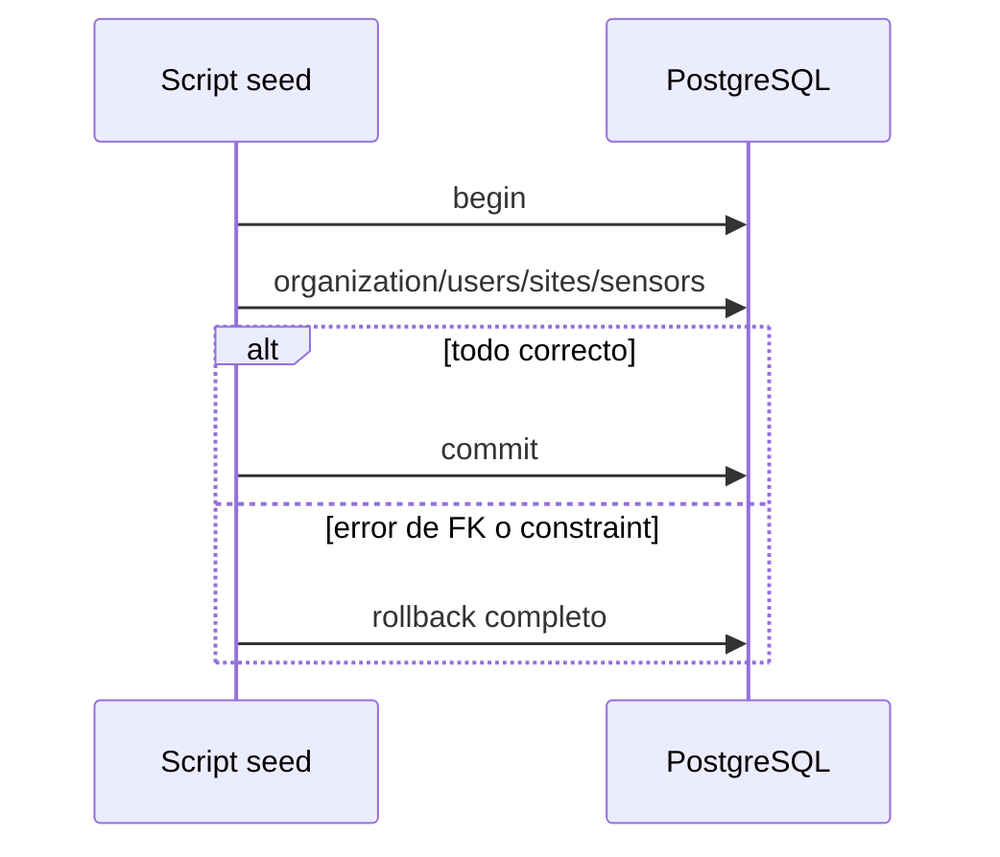

# Diagrama — Issue 05

## Antes y después

```mermaid
flowchart TD
 A[DB vacía] --> B[alembic upgrade head]
 B --> C[Ejecutar seed]
 C --> D[Organization]
 D --> E[Users + Sites]
 E --> F[Sensors]
 F --> G[(Datos demo listos)]
 H[Repetir seed] --> C
 C -. claves estables .-> I[No duplicar]
```

## Transacción

```mermaid
sequenceDiagram
 participant S as Script seed
 participant DB as PostgreSQL
 S->>DB: begin
 S->>DB: organization/users/sites/sensors
 alt todo correcto
  S->>DB: commit
 else error de FK o constraint
  S->>DB: rollback completo
 end
```
