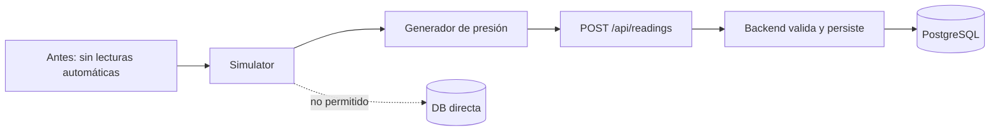

# Diagrama — Issue 06

```mermaid
flowchart LR
 A[Antes: sin lecturas automáticas] --> B[Simulator]
 B --> C[Generador de presión]
 C --> D[POST /api/readings]
 D --> E[Backend valida y persiste]
 E --> F[(PostgreSQL)]
 B -. no permitido .-> G[(DB directa)]
```
