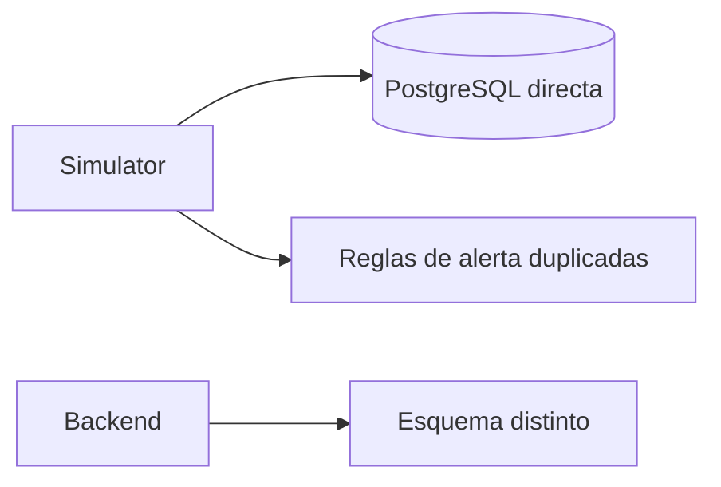
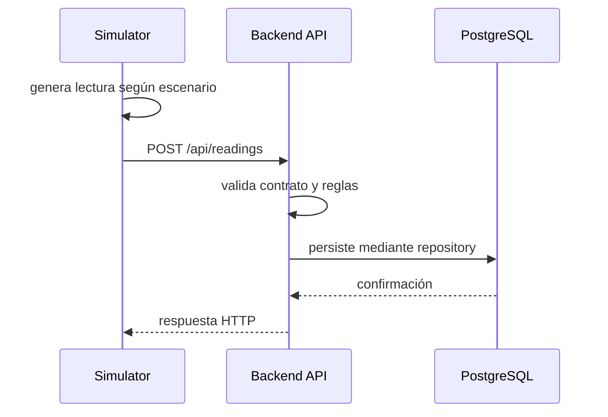

# Diagrama — Issue 06

## Antes: acoplamiento incorrecto

## Después: cliente externo y API como frontera

El simulador provoca datos; el backend conserva la autoridad sobre validación y persistencia.
