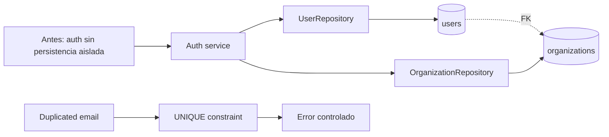

# Diagrama — Issue 07

```mermaid
flowchart LR
 A[Antes: auth sin persistencia aislada] --> B[Auth service]
 B --> C[UserRepository]
 B --> D[OrganizationRepository]
 C --> E[(users)]
 D --> F[(organizations)]
 E -. FK .-> F
 G[Duplicated email] --> H[UNIQUE constraint]
 H --> I[Error controlado]
```
