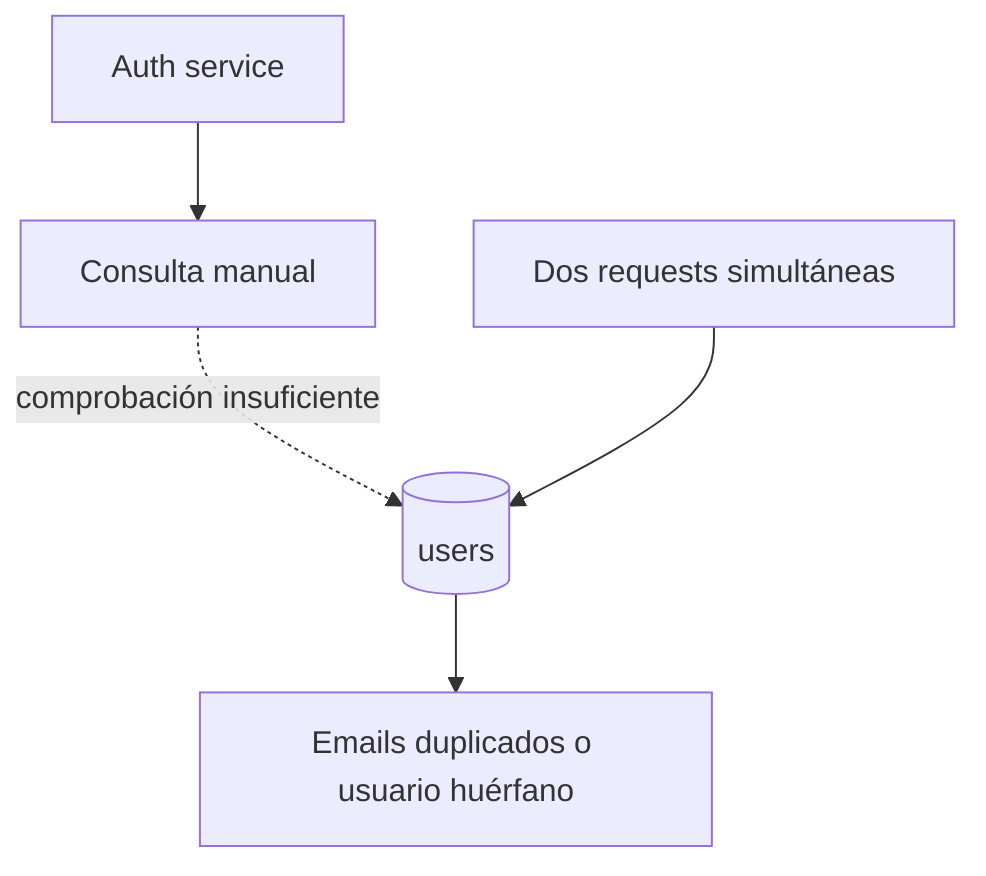
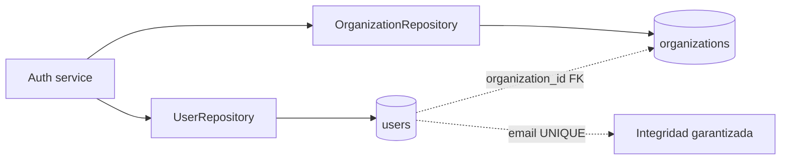

# Diagrama — Issue 07

## Antes y después

```mermaid
flowchart TD
 A[Auth service] --> B[Consulta manual]
 B -. comprobación insuficiente .-> C[(users)]
 D[Dos requests simultáneas] --> C
 C --> E[Emails duplicados o usuario huérfano]
```

```mermaid
flowchart LR
 A[Auth service] --> B[UserRepository]
 A --> C[OrganizationRepository]
 B --> D[(users)]
 C --> E[(organizations)]
 D -. organization_id FK .-> E
 D -. email UNIQUE .-> F[Integridad garantizada]
```

El primer flujo depende de convenciones de código; el segundo delega invariantes críticas a PostgreSQL.
