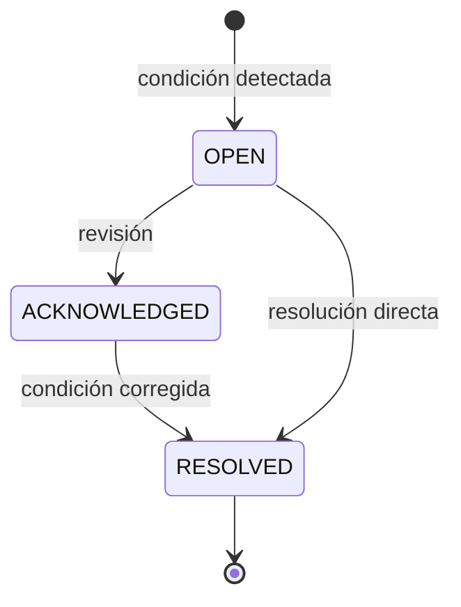

# Diagrama — Issue 08

```mermaid
stateDiagram-v2
 [*] --> OPEN: condición detectada
 OPEN --> ACKNOWLEDGED: revisión
 ACKNOWLEDGED --> RESOLVED: condición corregida
 OPEN --> RESOLVED: resolución directa
 RESOLVED --> [*]
```

Antes: alertas calculadas pero no persistidas. Después: historial consultable con estado y resolución.

