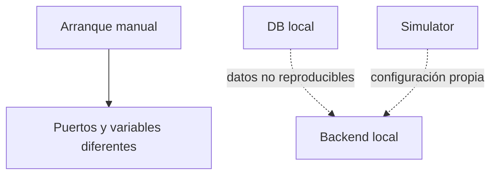
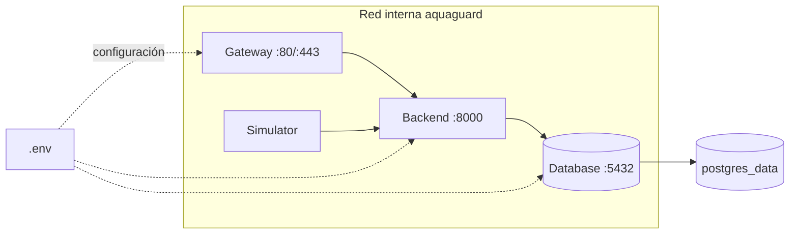
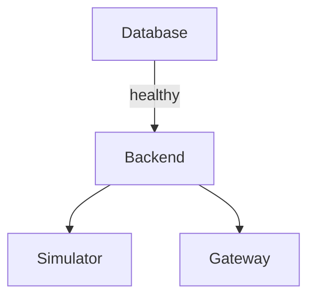

# Diagrama — Issue 09

## Antes y después

```mermaid
flowchart TD
 A[Arranque manual] --> B[Puertos y variables diferentes]
 C[DB local] -. datos no reproducibles .-> D[Backend local]
 E[Simulator] -. configuración propia .-> D
```

```mermaid
flowchart LR
 subgraph Red[Red interna aquaguard]
  G[Gateway :80/:443] --> BE[Backend :8000]
  SIM[Simulator] --> BE
  BE --> DB[(Database :5432)]
 end
 DB --> V[(postgres_data)]
 E[.env] -. configuración .-> G
 E -.-> BE
 E -.-> DB
```

## Dependencias de arranque

```mermaid
flowchart TD
 DB[Database] -->|healthy| BE[Backend]
 BE --> SIM[Simulator]
 BE --> G[Gateway]
```

El orden no reemplaza los healthchecks; solo expresa la dependencia esperada.
