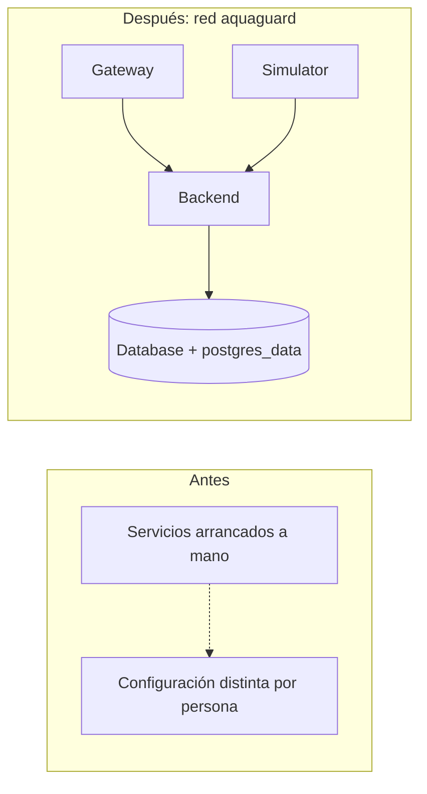

# Diagrama — Issue 09

```mermaid
flowchart LR
 subgraph Antes[Antes]
  A[Servicios arrancados a mano]
  A -.-> B[Configuración distinta por persona]
 end
 subgraph Despues[Después: red aquaguard]
  G[Gateway] --> BE[Backend]
  SIM[Simulator] --> BE
  BE --> DB[(Database + postgres_data)]
 end
```
