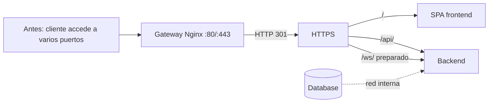

# Diagrama — Issue 10

```mermaid
flowchart LR
 A[Antes: cliente accede a varios puertos] --> B[Gateway Nginx :80/:443]
 B -->|HTTP 301| C[HTTPS]
 C -->|/| D[SPA frontend]
 C -->|/api/| E[Backend]
 C -->|/ws/ preparado| E
 F[(Database)] -. red interna .-> E
```
