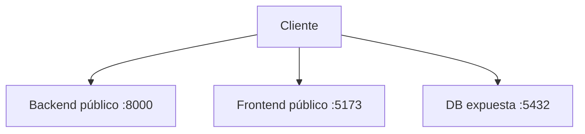
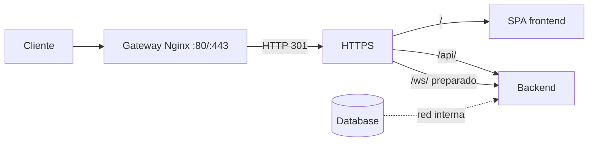

# Diagrama — Issue 10

## Antes y después

```mermaid
flowchart TD
 A[Cliente] --> B[Backend público :8000]
 A --> C[Frontend público :5173]
 A --> D[DB expuesta :5432]
```

```mermaid
flowchart LR
 A[Cliente] --> B[Gateway Nginx :80/:443]
 B -->|HTTP 301| C[HTTPS]
 C -->|/| D[SPA frontend]
 C -->|/api/| E[Backend]
 C -->|/ws/ preparado| E
 F[(Database)] -. red interna .-> E
```

El cliente conoce una sola entrada; Nginx conoce los upstreams internos.
