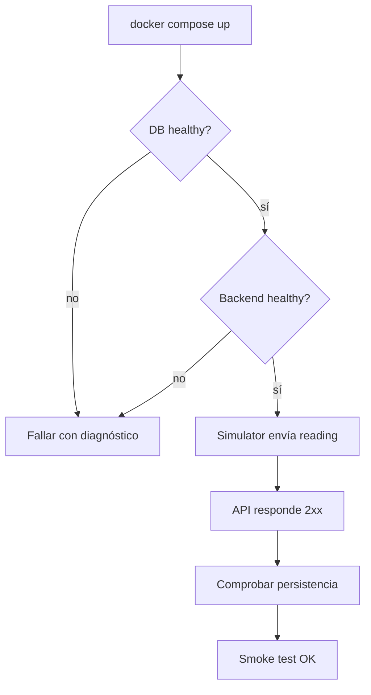

# Diagrama — Issue 11

```mermaid
flowchart TD
 A[docker compose up] --> B{DB healthy?}
 B -- no --> X[Fallar con diagnóstico]
 B -- sí --> C{Backend healthy?}
 C -- no --> X
 C -- sí --> D[Simulator envía reading]
 D --> E[API responde 2xx]
 E --> F[Comprobar persistencia]
 F --> G[Smoke test OK]
```
