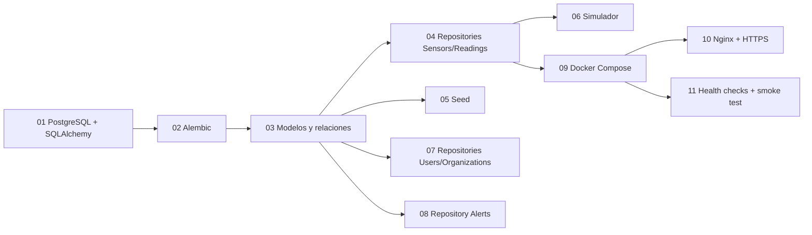

# Documentación de issues de Daruny

Esta documentación sigue las issues definidas en [`scripts/create_daruny_issues.sh`](../../scripts/create_daruny_issues.sh). Cada carpeta contiene cuatro documentos:

1. `01-issue.md`: alcance, propósito, requisitos, aprendizaje estimado y criterios de aceptación.
2. `02-conceptos.md`: conceptos técnicos necesarios, orden recomendado y tiempo de estudio.
3. `03-diagrama.md`: comparación visual del antes y el después mediante Mermaid.
4. `04-implementacion.md`: pasos concretos, ordenados y verificables.

## Orden recomendado

Las issues 04 y 05 desbloquean el vertical slice; la 06 depende además de que Ana exponga `POST /api/readings`. Las issues 09–11 son de infraestructura y se pueden preparar parcialmente mientras avanza el backend.

