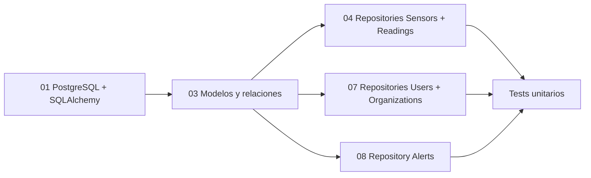
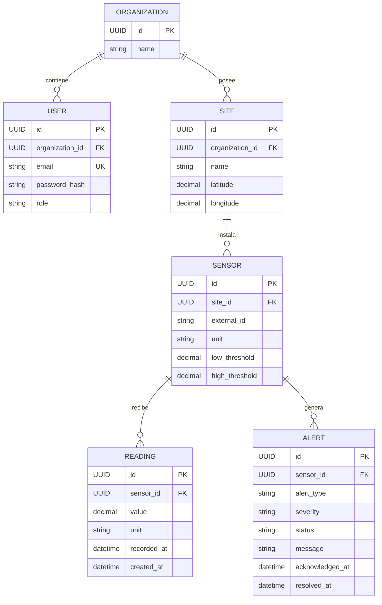
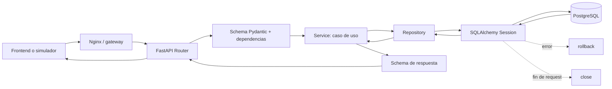
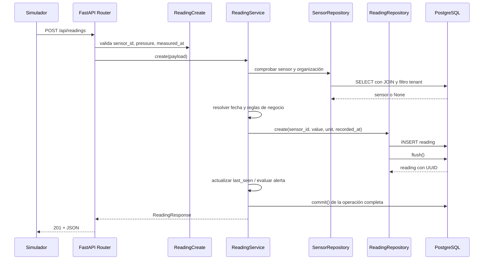
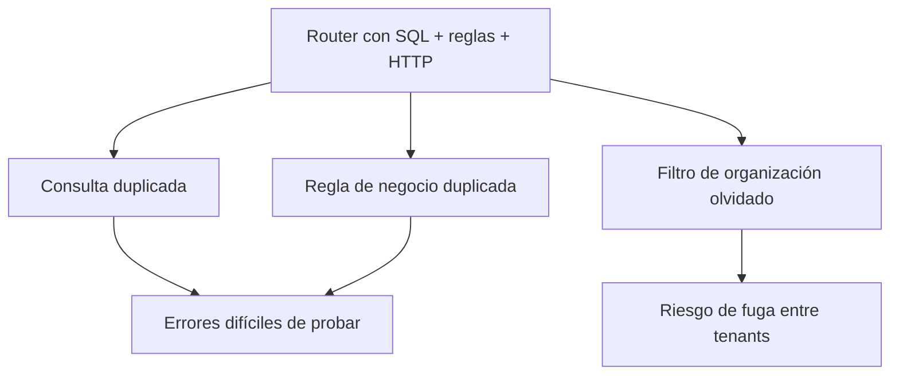
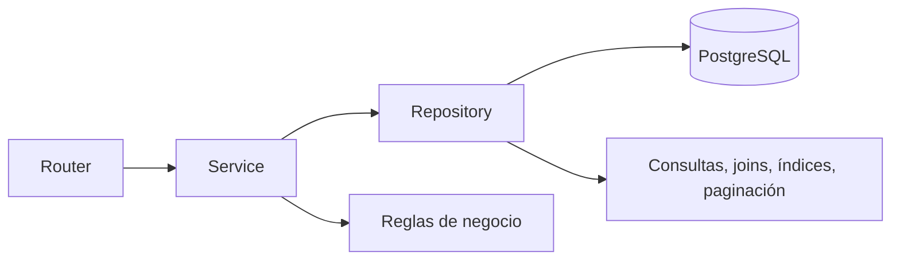

# AquaGuard — Modelos, Repositories y flujo del backend

> Guion visual para explicar al equipo el trabajo de Daruny en la persistencia y cómo circula una petición por el backend.

## 1. Idea principal

La implementación separa tres responsabilidades:

| Capa | Responsabilidad | No debería hacer |
| --- | --- | --- |
| Router | Recibir HTTP, validar entrada y devolver respuesta | Consultar SQL directamente |
| Service | Coordinar el caso de uso y aplicar reglas de negocio | Conocer detalles de SQLAlchemy |
| Repository | Leer y guardar entidades con SQLAlchemy | Decidir reglas de negocio o respuestas HTTP |
| Model | Representar tablas, relaciones e invariantes de base de datos | Resolver un caso de uso completo |

La idea que se puede decir en la presentación es:

> “El router sabe hablar HTTP, el service sabe qué significa la operación y el repository sabe dónde viven los datos.”

## 2. Qué se ha realizado

### Base de datos e infraestructura

- PostgreSQL configurado como base de datos del backend.
- SQLAlchemy configurado con un `Engine`, pool de conexiones y `SessionLocal`.
- `get_db()` crea una sesión por request y la cierra siempre.
- `transaction()` centraliza el patrón `commit` si todo va bien y `rollback` si falla.
- Alembic queda preparado para versionar el esquema.
- UUID como claves primarias y fechas con zona horaria.
- Tests unitarios con SQLite en memoria para validar repositories sin levantar todo el stack.

Archivos principales: [`database.py`](../../backend/app/core/database.py), [`env.py`](../../backend/migrations/env.py) y [`tests/unit`](../../backend/tests/unit/).

### Issues de Daruny relacionadas con esta capa

También se añadieron o prepararon documentación, configuración de Pytest, seed de desarrollo y soporte de Alembic dentro del contenedor backend.

## 3. Modelos implementados

Un modelo ORM tiene dos caras: una clase Python para trabajar con objetos y una tabla PostgreSQL que garantiza integridad aunque el dato llegue desde otra parte del sistema.

### Mapa del dominio

### `Organization`

Archivo: [`organizations/model.py`](../../backend/app/modules/organizations/model.py)

- Es el límite de aislamiento multi-organización o multi-tenant.
- Tiene `id`, `name`, `created_at` y `updated_at`.
- Mantiene relaciones ORM con `users` y `sites`.
- Un usuario, un site, un sensor, una lectura o una alerta solo debe ser visible dentro de la organización correspondiente.

### `User`

Archivo: [`users/model.py`](../../backend/app/modules/users/model.py)

- Tiene una FK obligatoria `organization_id` hacia `organizations`.
- `email` es único en base de datos.
- `password_hash` guarda el hash, nunca la contraseña en claro.
- `role` está protegido por un `CHECK` de base de datos.
- La relación `User.organization` permite navegar hacia su organización.
- `ondelete="RESTRICT"` evita borrar una organización que todavía tiene usuarios.

### `Site`

Archivo: [`sites/model.py`](../../backend/app/modules/sites/model.py)

- Representa un lugar físico propiedad de una organización.
- Tiene FK `organization_id`.
- No permite repetir el mismo nombre dentro de una organización mediante `UNIQUE(organization_id, name)`.
- Las coordenadas tienen `CHECK`: latitud entre `-90` y `90`, longitud entre `-180` y `180`.
- Usa `Numeric` para conservar precisión en coordenadas.
- Se relaciona con su `organization` y con sus `sensors`.

### `Sensor`

Archivo: [`sensors/model.py`](../../backend/app/modules/sensors/model.py)

- Representa el dispositivo instalado en un site.
- Tiene FK `site_id`; la organización se obtiene subiendo `sensor → site → organization`.
- `external_id` es único dentro de cada site mediante `UNIQUE(site_id, external_id)`.
- Los umbrales están protegidos por un `CHECK` que exige `low_threshold < high_threshold` cuando existen ambos.
- Tiene unidad, estado activo y timestamps.
- Se relaciona con `site`, `readings` y `alerts`.

### `Reading`

Archivo: [`readings/model.py`](../../backend/app/modules/readings/model.py)

- Representa una medición histórica, no la configuración del sensor.
- Tiene FK obligatoria `sensor_id`.
- Guarda `value`, `unit`, `recorded_at` —cuándo se tomó la medida— y `created_at` —cuándo la registró el backend—.
- Usa `Numeric(10, 3)` para el valor medido.
- Tiene índice `(sensor_id, recorded_at)` para consultar rápidamente el histórico.
- `ondelete="RESTRICT"` protege el histórico frente a borrados accidentales.

### `Alert`

Archivo: [`alerts/model.py`](../../backend/app/modules/alerts/model.py)

- Representa una anomalía persistida y auditable.
- Tiene FK `sensor_id`, tipo, severidad, mensaje y estado.
- Los `CHECK` limitan los valores válidos:
  - tipo: `LOW_PRESSURE`, `HIGH_PRESSURE`, `SENSOR_OFFLINE`;
  - estado: `ACTIVE`, `RESOLVED`;
  - severidad: `WARNING`, `CRITICAL`.
- Guarda `acknowledged_at` y `resolved_at` para conservar el ciclo de vida.
- Tiene índices por sensor/fecha y estado/fecha.
- La regla que decide si una reading genera una alerta pertenece al service, no al modelo ni al repository.

## 4. Repositories implementados

Todos reciben una `Session` de SQLAlchemy en el constructor. No crean una conexión nueva por método y no hacen HTTP.

### `SensorRepository`

Archivo: [`sensors/repository.py`](../../backend/app/modules/sensors/repository.py)

Métodos relevantes:

- `list_by_organization(organization_id, offset, limit)`:
  - hace `JOIN` con `Site`;
  - filtra por `Site.organization_id`;
  - devuelve elementos y total;
  - ordena por `Sensor.id` y aplica paginación.
- `get_by_id(sensor_id, organization_id)`:
  - busca por ID;
  - comprueba simultáneamente la organización;
  - devuelve `None` si el sensor no existe o pertenece a otra organización.

Esto evita que un ID válido de un cliente permita leer datos de otro cliente.

### `ReadingRepository`

Archivo: [`readings/repository.py`](../../backend/app/modules/readings/repository.py)

Métodos relevantes:

- `create(sensor_id, value, unit, recorded_at)`:
  - construye una entidad `Reading`;
  - la añade a la sesión;
  - usa `flush()` para enviar el `INSERT` y obtener el UUID;
  - hace `rollback()` si SQLAlchemy lanza un error;
  - no hace `commit()`: la transacción completa la coordina el caso de uso.
- `list_by_sensor(sensor_id, organization_id, offset, limit)`:
  - une `Reading → Sensor → Site`;
  - filtra por sensor y organización;
  - calcula el total;
  - ordena por `recorded_at` y `created_at`;
  - limita el tamaño de la respuesta.

El orden secundario por `created_at` hace que dos lecturas con la misma fecha de medida tengan un orden estable.

### `UserRepository`

Archivo: [`users/repository.py`](../../backend/app/modules/users/repository.py)

- `get_by_email()` normaliza espacios y mayúsculas antes de consultar.
- `get_by_id()` exige también `organization_id` para respetar el aislamiento.
- `create()` recibe un `password_hash` ya calculado, guarda la entidad, hace `flush()` y revierte la sesión ante errores.
- La unicidad real del email la garantiza PostgreSQL con `unique=True`; la comprobación previa del service solo mejora el mensaje al usuario.

El repository no hashea contraseñas, no decide permisos y no devuelve respuestas HTTP.

### `OrganizationRepository`

Archivo: [`organizations/repository.py`](../../backend/app/modules/organizations/repository.py)

- `get_by_id()` reutiliza `Session.get()` para buscar una organización por su UUID.
- Devuelve `None` si no existe.
- Es una operación pequeña, pero permite que auth y los services no conozcan directamente la sesión.

### `AlertRepository`

Archivo: [`alerts/repository.py`](../../backend/app/modules/alerts/repository.py)

- `create()` crea alertas inicialmente `ACTIVE` y hace `flush()`.
- `get_by_id()` y `list_by_organization()` recorren `Alert → Sensor → Site` para aplicar el filtro de organización.
- El listado acepta filtros por `status` y `sensor_id`, además de paginación.
- `acknowledge()` solo fija `acknowledged_at` la primera vez: es idempotente.
- `resolve()` cambia a `RESOLVED` y guarda `resolved_at`.

La decisión de cuándo crear, agrupar o reabrir una alerta debe estar en `AlertService`; el repository solo ofrece operaciones de persistencia.

## 5. Flujo de una petición en el backend

### Vista general

### Ejemplo: guardar una lectura

### Qué diferencia hay entre `flush`, `commit`, `rollback` y `close`

| Operación | Significado |
| --- | --- |
| `flush()` | Envía cambios a la base dentro de la transacción; permite obtener un ID sin confirmar todavía. |
| `commit()` | Confirma definitivamente todos los cambios de la unidad de trabajo. |
| `rollback()` | Deshace los cambios pendientes cuando algo falla. |
| `close()` | Libera la sesión y sus recursos al terminar la request. |

La razón de no hacer `commit()` dentro de cada repository es poder tratar una operación completa como una sola unidad. Por ejemplo: guardar la lectura, actualizar el sensor y crear una alerta deben confirmarse juntas o deshacerse juntas.

## 6. Por qué es buena idea tener repositories y services

### Repository

1. **Evita duplicación:** las consultas de sensores, históricos y alertas viven en un lugar.
2. **Refuerza seguridad:** el filtro `organization_id` se aplica de forma consistente.
3. **Facilita tests:** se puede probar la persistencia con SQLite en memoria o sustituir el repository por un fake.
4. **Mejora rendimiento:** índices, joins, orden y paginación quedan centralizados.
5. **Permite cambiar infraestructura:** el service no necesita saber si los datos vienen de PostgreSQL, otro adapter o una implementación de prueba.

### Service

1. **Concentra reglas de negocio:** por ejemplo, comprobar umbrales y decidir si una lectura crea una alerta.
2. **Coordina varias escrituras:** reading + actualización de sensor + alerta pueden vivir en una transacción.
3. **Reutiliza lógica:** la misma operación puede ser llamada por HTTP, WebSocket o un job periódico.
4. **Aísla HTTP del dominio:** no hay códigos HTTP, `Request` ni `Response` dentro de la lógica.
5. **Hace las decisiones explícitas:** el repository devuelve `None`; el service decide si eso significa 404, conflicto u otra respuesta.

### La separación evita este problema

Con capas:

## 7. Pruebas realizadas

Los tests unitarios cubren, entre otros casos:

- creación y búsqueda de usuarios;
- normalización de emails;
- aislamiento de usuarios por organización;
- email duplicado y rollback;
- búsqueda de organizaciones inexistentes;
- sensores visibles solo para su organización;
- histórico de readings paginado y ordenado;
- histórico que no cruza la frontera entre organizaciones;
- validación de paginación;
- creación de alertas activas;
- filtros de alertas por estado y sensor;
- `acknowledge()` idempotente;
- `resolve()` con `resolved_at`.

Archivos: [`test_user_organization_repositories.py`](../../backend/tests/unit/test_user_organization_repositories.py), [`test_sensor_reading_repositories.py`](../../backend/tests/unit/test_sensor_reading_repositories.py) y [`test_alert_repository.py`](../../backend/tests/unit/test_alert_repository.py).

## 8. Estado actual y puntos a alinear con el equipo

Para explicarlo con rigor, conviene distinguir entre “persistencia implementada” y “flujo de negocio terminado”.

### Implementado

- Modelos ORM de las seis entidades.
- Relaciones y claves foráneas.
- Constraints, índices y timestamps principales.
- Repositories de organizations, users, sensors, readings y alerts.
- Tests unitarios de los repositories.
- Infraestructura de sesión, transacciones y Alembic.

### Preparado pero todavía no completado

- Varios services aún lanzan `NotImplementedYetError`; son el punto donde Ana debe conectar los repositories y completar los casos de uso.
- `SiteRepository` todavía no tiene operaciones implementadas.
- `acknowledge()` y `resolve()` del `AlertRepository` deberían recibir también `organization_id` antes de exponerse a usuarios, para mantener el mismo aislamiento que las consultas de lectura.

### Alineaciones necesarias

- El modelo `User` restringe `role` a `ADMIN/CLIENT`, mientras el schema documenta valores `admin/client`. Debe elegirse una única representación.
- El modelo `Sensor` usa `external_id`, `unit`, `low_threshold`, `high_threshold` e `is_active`; el schema actual documenta también nombres como `min_pressure`, `max_pressure`, `status` y `last_seen_at`. Hay que acordar el contrato final y crear la migración correspondiente.
- El modelo `Alert` usa `alert_type`, mientras el schema de respuesta documenta `type`; conviene resolver el mapeo en el schema o unificar el nombre.

Estos puntos no invalidan el trabajo de persistencia; son el siguiente paso de integración entre contrato, service y base de datos.

## 9. Guion breve para presentarlo

1. **Contexto:** “Necesitábamos persistir datos de organizaciones, sites, sensores, lecturas y alertas sin mezclar clientes.”
2. **Modelos:** “Definí las entidades, relaciones, FK, constraints, índices y timestamps para que la base también proteja la integridad.”
3. **Repositories:** “Encapsulé las consultas SQLAlchemy y añadí filtros por organización, paginación y rollback.”
4. **Transacciones:** “El repository hace `flush` cuando necesita el ID, pero el `commit` queda al nivel del caso de uso para confirmar varias operaciones juntas.”
5. **Services:** “El service es quien decide qué significa cada resultado y aplica reglas como umbrales, permisos y alertas.”
6. **Beneficio:** “Así cada capa tiene una responsabilidad clara, se puede probar de forma aislada y se reduce el riesgo de fugas entre organizaciones.”
7. **Siguiente paso:** “Ahora hay que conectar los services, completar SiteRepository y cerrar las alineaciones de contrato antes de publicar todos los endpoints.”

## 10. Frase final

> “La base de datos garantiza que los datos sean válidos; el repository sabe cómo persistirlos; el service sabe qué significa la operación; y el router solo expone el resultado al cliente.”
