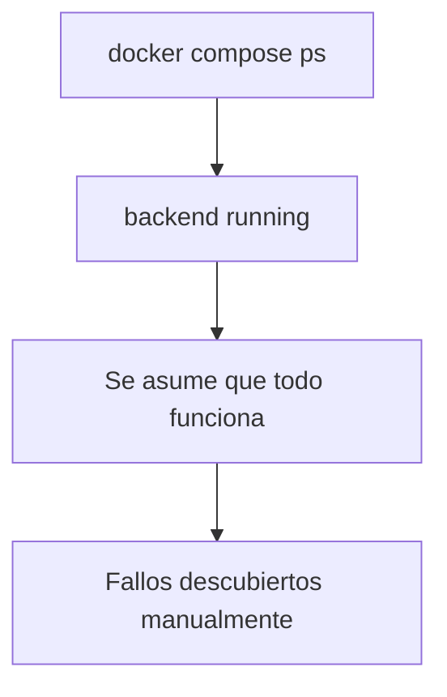
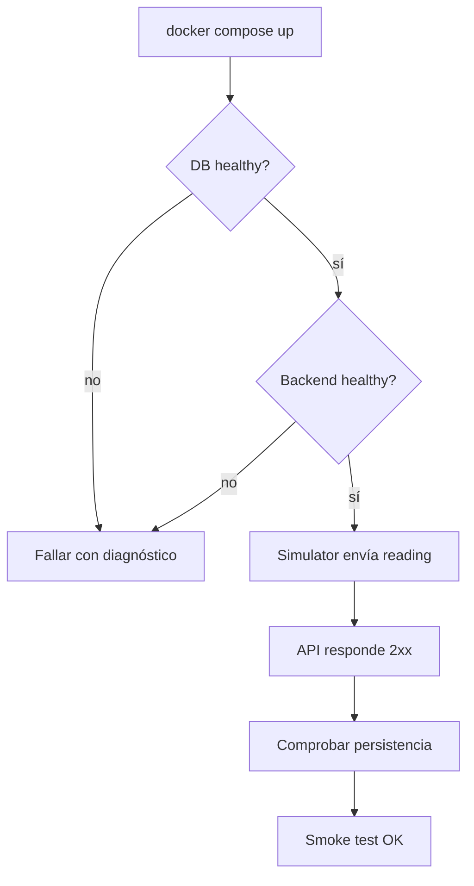
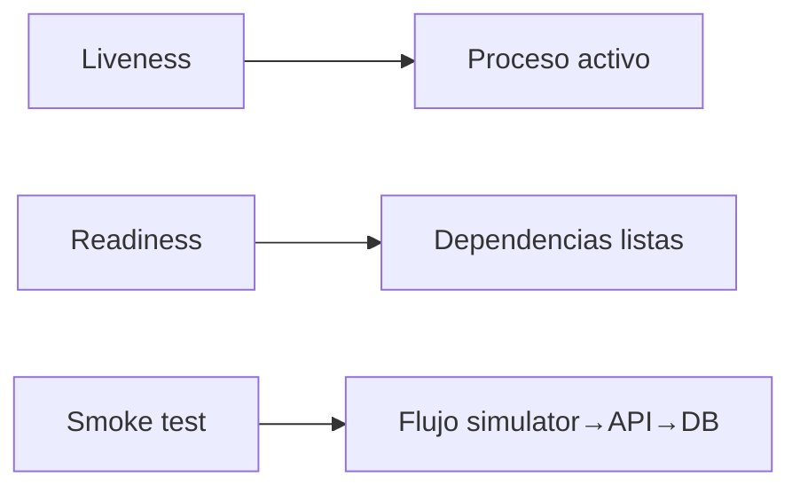

# Diagrama — Issue 11

## Antes: solo comprobar contenedores

```mermaid
flowchart TD
 A[docker compose ps] --> B[backend running]
 B --> C[Se asume que todo funciona]
 C --> D[Fallos descubiertos manualmente]
```

## Después: readiness y recorrido funcional

```mermaid
flowchart TD
 A[docker compose up] --> B{DB healthy?}
 B -- no --> X[Fallar con diagnóstico]
 B -- sí --> C{Backend healthy?}
 C -- no --> X
 C -- sí --> D[Simulator envía reading]
 D --> E[API responde 2xx]
 E --> F[Comprobar persistencia]
 F --> G[Smoke test OK]
```

## Tipos de comprobación

```mermaid
flowchart LR
 A[Liveness] --> B[Proceso activo]
 C[Readiness] --> D[Dependencias listas]
 E[Smoke test] --> F["Flujo simulator→API→DB"]
```
