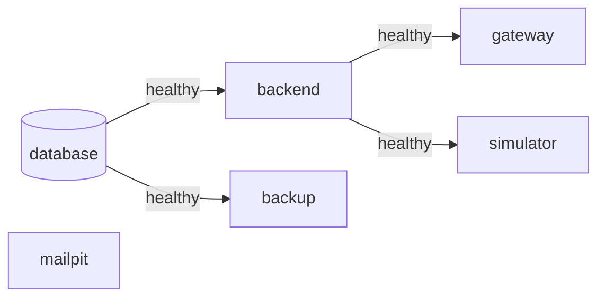
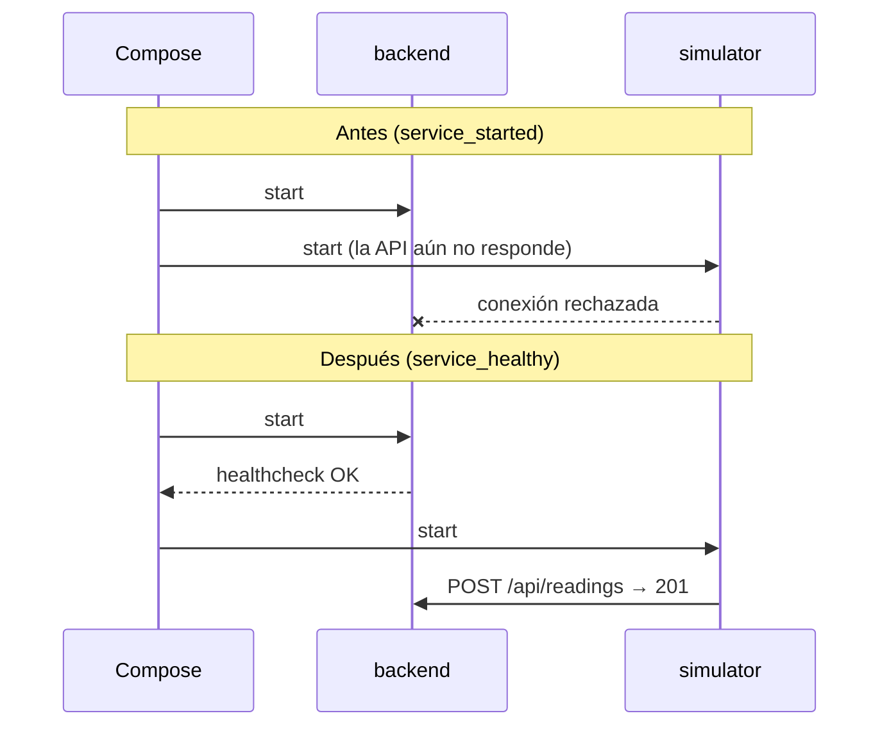
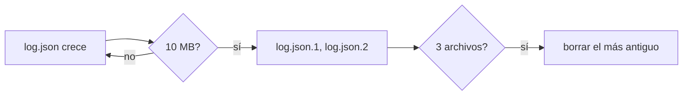

# Diagrama — Issue 18

## Orden de arranque

```mermaid
flowchart LR
 DB[(database)] -- healthy --> BE[backend]
 DB -- healthy --> BK[backup]
 BE -- healthy --> GW[gateway]
 BE -- healthy --> SIM[simulator]
 MP[mailpit]
```

Mailpit no tiene dependencias y el backend no depende de él: si está parado,
la app responde igual.

## Antes y después en el simulador

```mermaid
sequenceDiagram
 participant C as Compose
 participant B as backend
 participant S as simulator
 Note over C,S: Antes (service_started)
 C->>B: start
 C->>S: start (la API aún no responde)
 S--xB: conexión rechazada
 Note over C,S: Después (service_healthy)
 C->>B: start
 B-->>C: healthcheck OK
 C->>S: start
 S->>B: POST /api/readings → 201
```

## Rotación

```mermaid
flowchart LR
 A[log.json crece] --> B{10 MB?}
 B -- no --> A
 B -- sí --> C[log.json.1, log.json.2]
 C --> D{3 archivos?}
 D -- sí --> E[borrar el más antiguo]
```
