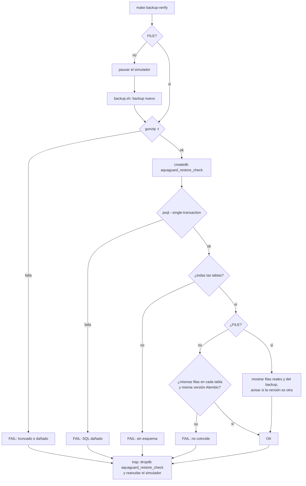
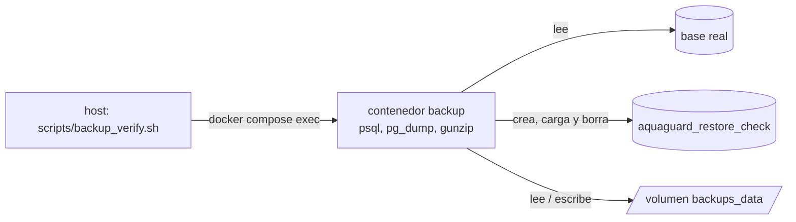

# Diagrama — Issue 19

```mermaid
flowchart TD
 A[make backup-verify] --> B{FILE?}
 B -- no --> C[pausar el simulador]
 C --> D[backup.sh: backup nuevo]
 D --> G{gunzip -t}
 B -- sí --> G
 G -- falla --> X[FAIL: truncado o dañado]
 G -- ok --> H[createdb aquaguard_restore_check]
 H --> I{psql --single-transaction}
 I -- falla --> Y[FAIL: SQL dañado]
 I -- ok --> J{¿todas las tablas?}
 J -- no --> Z[FAIL: sin esquema]
 J -- sí --> K{¿FILE?}
 K -- no --> L{¿mismas filas en cada tabla<br/>y misma versión Alembic?}
 L -- no --> W[FAIL: no coincide]
 L -- sí --> OK[OK]
 K -- sí --> M[mostrar filas reales y del backup,<br/>avisar si la versión es otra]
 M --> OK
 X & Y & Z & W & OK --> T[trap: dropdb aquaguard_restore_check<br/>y reanudar el simulador]
```

## Dónde se ejecuta cada cosa

```mermaid
flowchart LR
 H[host: scripts/backup_verify.sh] -- docker compose exec --> B[contenedor backup<br/>psql, pg_dump, gunzip]
 B -- lee --> R[(base real)]
 B -- crea, carga y borra --> T[(aquaguard_restore_check)]
 B -- lee / escribe --> V[/volumen backups_data/]
```
