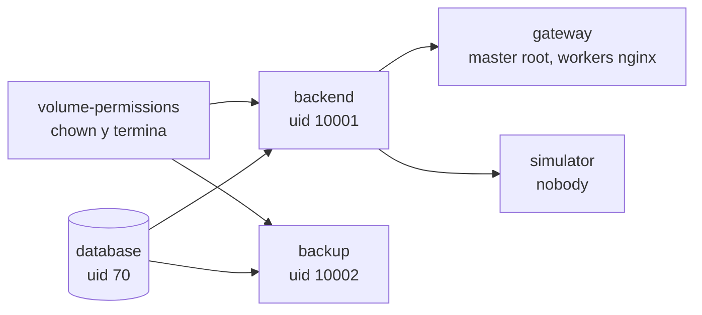
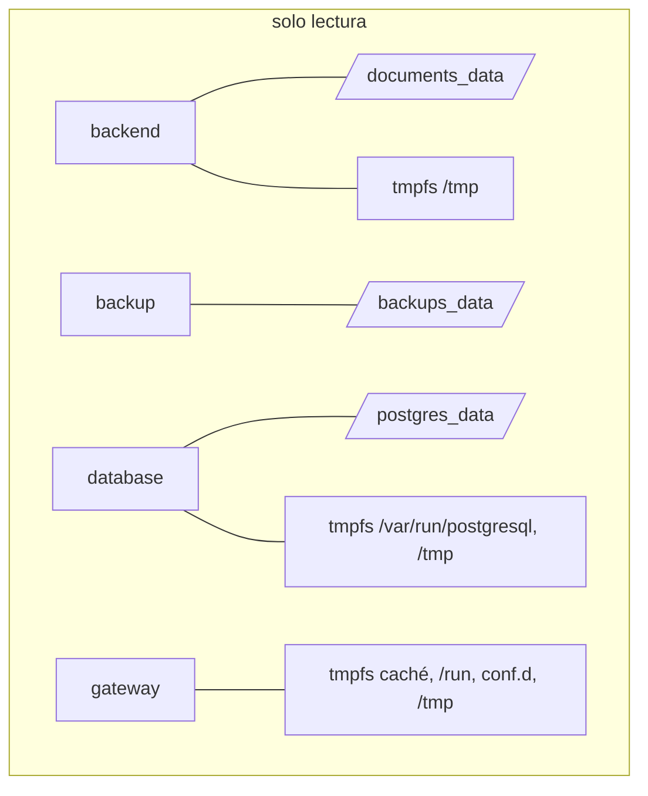

# Diagrama — Issue 20

## Arranque

```mermaid
flowchart LR
 VP[volume-permissions<br/>chown y termina] --> B[backend<br/>uid 10001]
 VP --> BK[backup<br/>uid 10002]
 DB[(database<br/>uid 70)] --> B
 DB --> BK
 B --> G[gateway<br/>master root, workers nginx]
 B --> S[simulator<br/>nobody]
```

## Qué puede escribir cada contenedor

```mermaid
flowchart TD
 subgraph solo lectura
  B[backend] --- D[/documents_data/]
  B --- T1[tmpfs /tmp]
  BK[backup] --- V[/backups_data/]
  DB[database] --- P[/postgres_data/]
  DB --- T2[tmpfs /var/run/postgresql, /tmp]
  G[gateway] --- T3[tmpfs caché, /run, conf.d, /tmp]
 end
```
