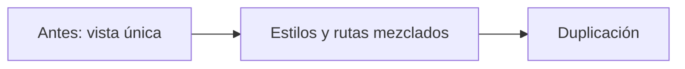
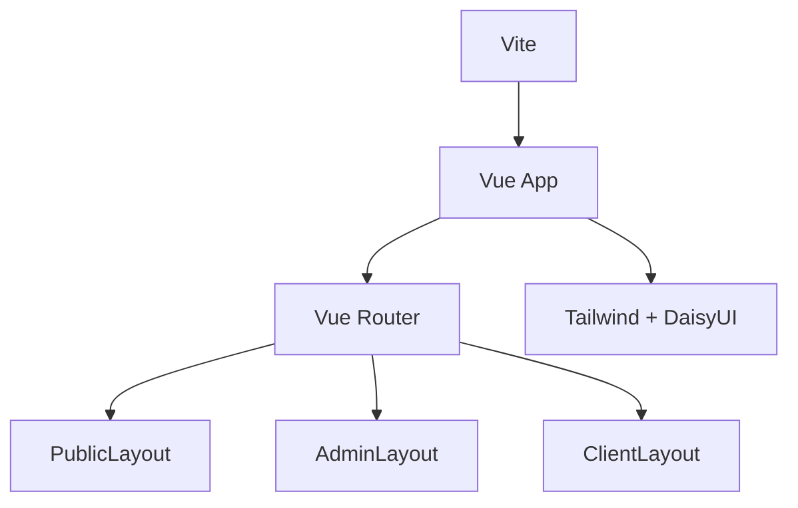
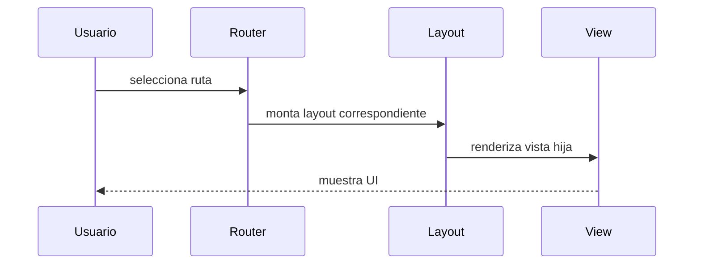

# Diagrama — Issue 01

La configuración central permite que todas las vistas compartan navegación y lenguaje visual.

## Navegación

El flujo no incluye todavía stores, API ni autenticación; esas responsabilidades se añaden en issues posteriores.
