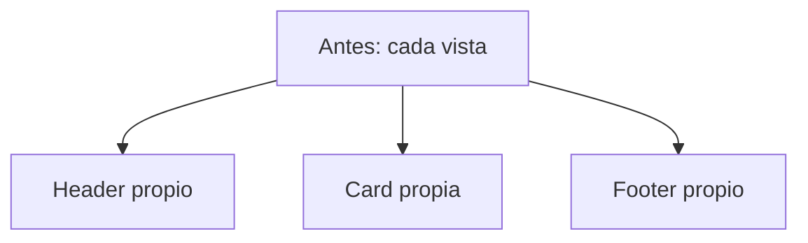
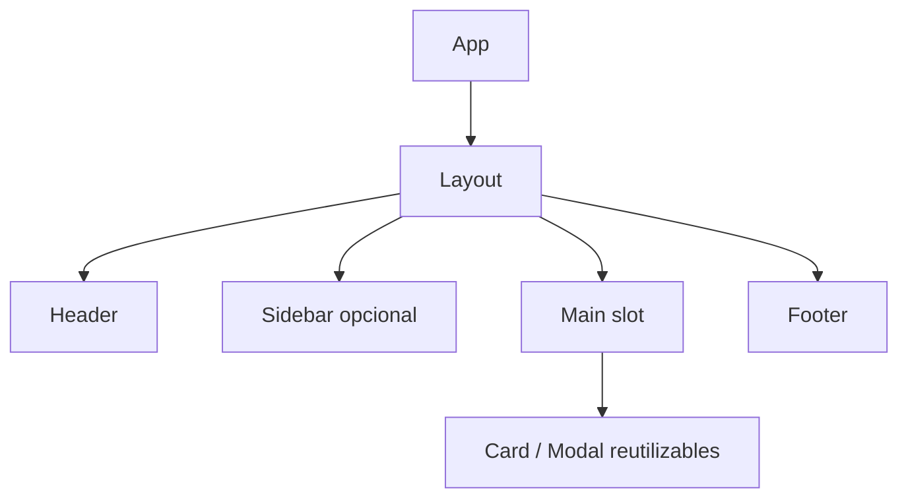
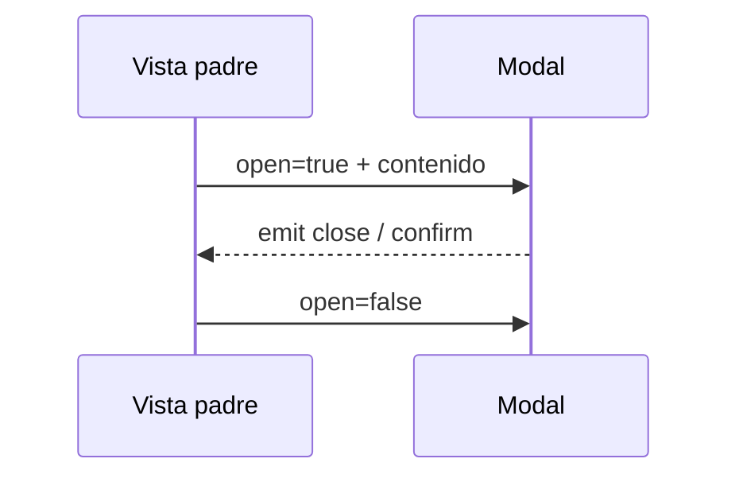

# Diagrama — Issue 02

```mermaid
flowchart TD
 A[Antes: cada vista] --> B[Header propio]
 A --> C[Card propia]
 A --> D[Footer propio]
```

```mermaid
flowchart TD
 A[App] --> B[Layout]
 B --> C[Header]
 B --> D[Sidebar opcional]
 B --> E[Main slot]
B --> F[Footer]
 E --> G[Card / Modal reutilizables]
```

## Interacción de un Modal

```mermaid
sequenceDiagram
 participant P as Vista padre
 participant M as Modal
 P->>M: open=true + contenido
 M-->>P: emit close / confirm
 P->>M: open=false
```
