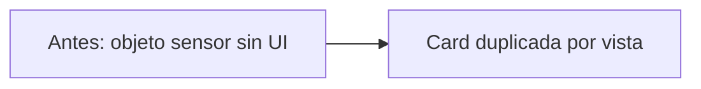
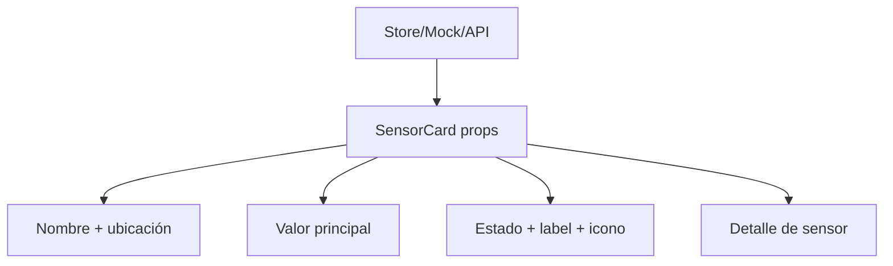
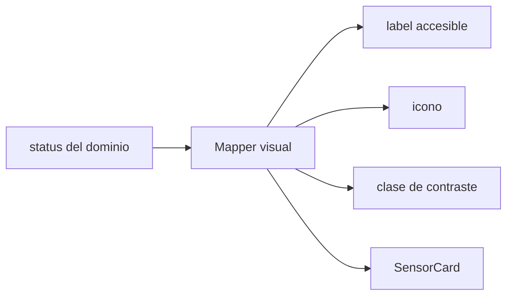

# Diagrama — Issue 03

```mermaid
flowchart LR
 A[Antes: objeto sensor sin UI] --> B[Card duplicada por vista]
```

```mermaid
flowchart TD
 A[Store/Mock/API] --> B[SensorCard props]
 B --> C[Nombre + ubicación]
 B --> D[Valor principal]
 B --> E[Estado + label + icono]
B --> F[Detalle de sensor]
```

## Transformación de estado

```mermaid
flowchart LR
 A[status del dominio] --> B[Mapper visual]
 B --> C[label accesible]
 B --> D[icono]
 B --> E[clase de contraste]
 B --> F[SensorCard]
```
