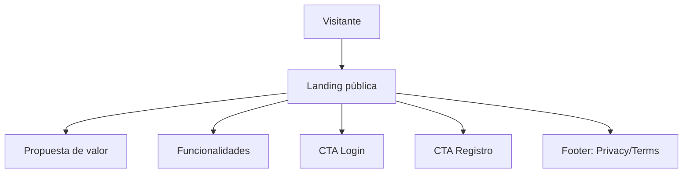
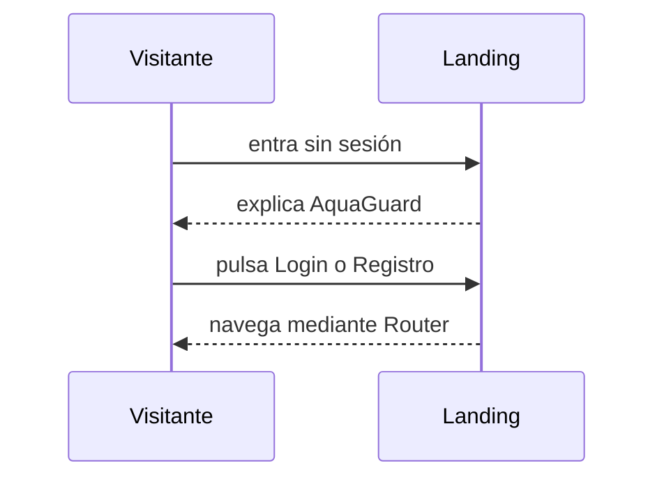

# Diagrama — Issue 04

```mermaid
flowchart TD
 A[Visitante] --> B[Landing pública]
 B --> C[Propuesta de valor]
 B --> D[Funcionalidades]
 B --> E[CTA Login]
 B --> F[CTA Registro]
 B --> G[Footer: Privacy/Terms]
```

Antes: ruta pública sin orientación. Después: recorrido claro hacia información o autenticación.

## Recorrido del usuario

```mermaid
sequenceDiagram
 participant U as Visitante
 participant L as Landing
 U->>L: entra sin sesión
 L-->>U: explica AquaGuard
 U->>L: pulsa Login o Registro
 L-->>U: navega mediante Router
```
