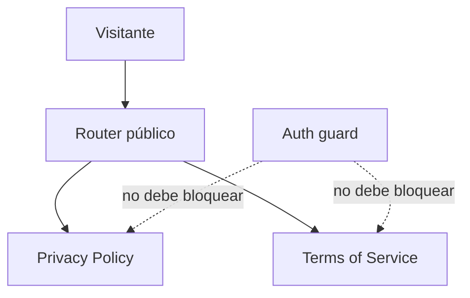

# Diagrama — Issue 05

```mermaid
flowchart LR
 A[Footer compartido] --> B[/privacy]
 A --> C[/terms]
 D[Visitante sin sesión] --> B
 D --> C
 B --> E[Contenido Privacy]
 C --> F[Contenido Terms]
```

Antes: enlaces legales ausentes o inaccesibles. Después: rutas públicas y visibles desde la navegación común.

## Regla de acceso


